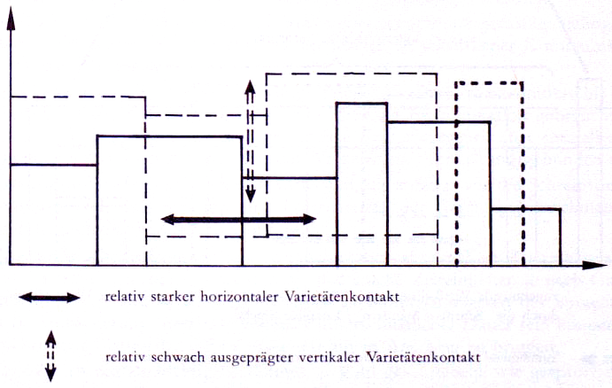
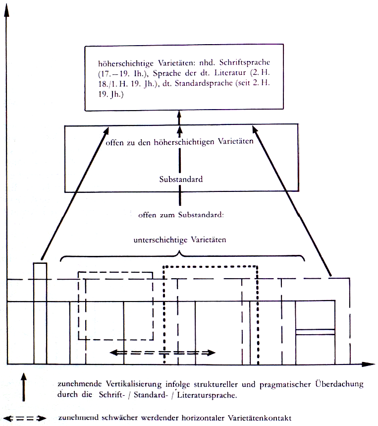

##5\. Der Gegenstand des Wörterbuches
Gegenstand des Wörterbuches ist der Wortschatz des Frühneuhochdeutschen. In dieser Aussage sind die Begriffe ‚Frühneuhochdeutsch‘ und ‚Wortschatz‘ zu erläutern, ersterer unter dem Gesichtspunkt der Diagliederung, letzterer unter dem Aspekt der Stichwortauswahl.

### 5.1\. Zum Begriff ‚Frühneuhochdeutsch‘

Das Frühneuhochdeutsche ist wie jede historische Sprachstufe jeder geschichtlichen Einzelsprache eine Gesamtheit von Varietäten. Als im Vergleich zum Mittelhochdeutschen wie vor allem zum späteren Neuhochdeutschen spezifisch kommt hinzu, daß die einzelnen Varietäten nicht in der Weise von einer anerkannten Leitvarietät überdacht werden, wie es im Neuhochdeutschen vom 17\. bis zum 19\. Jahrhundert durch die Schriftsprache, darunter zeitweilig die Literatursprache (hier verstanden als Sprache der deutschen Literatur), und seit der zweiten Hälfte des 19\. Jahrhunderts durch die Standardsprache geschieht, sondern daß sie auf einer vergleichsweise nur geringfügig schwankenden Prestigestufe eher horizontal nebeneinander stehen als vertikal auf eine Form von Hochsprache hin ausgerichtet sind. Selbstverständlich schließt dieses Bild eines eher horizontalen Nebeneinanders von Varietäten wechselseitige Beeinflussungen nicht aus; diese verlaufen allerdings, wie vor allem die großen sprachgeographischen Veränderungen (Monophthongierung, Diphthongierung, Dehnung in offener Silbe, oberdeutsche Apokopierung[^28] usw.) beweisen, entscheidend horizontal, sind mithin nicht aus vertikaler Überdachung verstehbar, wie sie für die Geschichte der deutschen Sprache seit dem 16\. Jahrhundert typisch ist[^29]\. 

Abb. 2: Das vorwiegend horizontale Nebeneinander der Varietäten des Frühneuhochdeutschen, vor allem im 14\. und 15\. Jahrhundert

Bezeichnenderweise gibt es seit dieser Zeit ja auch keine geographischen Veränderungen mehr, denen die Bedeutung der oben genannten zugesprochen werden könnte. Die folgenden beiden Schemata sollen die Verhältnisse grob veranschaulichen.

Abb. 3: Die Vertikalisierung der Varietäten des Neuhochdeutschen

5.1.1\. Ein Wörterbuch über eine Sprachstufe ohne anerkannte Leitvarietät kann sich nicht auf die Beschreibung der Ansätze überregionaler, zum Beispiel geschäfts- oder literatursprachlicher Varianten beschränken, sondern hat idealiter das gesamte Varietätenspektrum zum Gegenstand, auch wenn in der Praxis Grenzen gezogen werden müssen (vgl. dazu 5.2.2.). Am Vergleich mit einem denkbaren lexikographischen Unternehmen zum Neuhochdeutschen verdeutlicht: Es ist tendenziell so, als wenn jemand ein Wörterbuch über die vergangenen 300 Jahre deutscher Sprachgeschichte schreiben und dabei Dialekte, Fachsprachen, Sondersprachen usw. gleichberechtigt, wenn auch nicht mit allen Ausdifferenzierungen, einbeziehen würde. Allerdings hinkt der Vergleich eben dadurch, daß sich das Varietätenspektrum prinzipiell verändert, nämlich stark vertikalisiert hat.

5.1.2\. Das Varietätenspektrum des Frühneuhochdeutschen läßt sich nach den Kriterien ‚sprachlicher Handlungsraum‘, ‚kommunikationsgeschichtlich abgrenzbare Zeiteinheit‘, ‚für das Sprachhandeln relevante soziale Schicht‘, ‚kommunikativ bestimmte Gruppe‘, ‚kommunikativ relevanter Situationstyp‘ und ‚sprachlicher Handlungsspielraum des Individuums‘ überschaubar machen. Da sich diese Kriterien nicht ausschließen, können keine 1:1-Zuordnungen von Kriterium und Varietät erfolgen, etwa in der Weise, daß z. B. dem Raumkriterium die Varietät ‚Dialekt‘ entspräche. Vielmehr ist mit mannigfachen Überlappungen und innerhalb dieser mit unterschiedlichen Gewichtungen zu rechnen. Folgende Varietäten spielen in der sprachgeschichtlichen Realität des Frühneuhochdeutschen eine besondere Rolle:

– _Dialekte_ als raumgebundene, in der damaligen Zeit von allen Sozialschichten vorwiegend in sprechsprachlichen Situationen gebrauchte Varietäten,

– _landschaftliche Schreibsprachen,_ auch _Schreibdialekte_ genannt, als gemäßigt raumgebundene, sozial mittel- bis oberschichtig bestimmte, in schriftlicher Kommunikation gebrauchte Varietäten,

– _Geschäftssprachen_ als ebenfalls gemäßigt raumgebundene, sozial mittel- bis oberschichtig bestimmte, vorwiegend in schriftlicher Kommunikation gebrauchte Varietäten, die gegenüber den landschaftlichen Schreibsprachen aber speziell an die Kommunikationsbereiche von Handel, Verkehr und Verwaltung gebunden sind,

– _(landschaftliche) Druckersprachen_ als Varietäten, die anfangs wie die Schreibsprachen bestimmt sind, sich aber mit dem Fortschreiten der Geschichte zunehmend aus ihren landschaftlichen Bindungen lösen,

– _Historiolekte_ als für kommunikationsgeschichtlich abgrenzbare Zeiteinheiten typische Varietäten, wobei zu beachten ist, daß solche Zeiteinheiten je nach Gruppe, Schicht, Raum und situationsgebundenen Handlungsinteressen der Sprachträger (z. B. Archaisierungsinteresse) von sehr unterschiedlicher Dauer sein können. Für geschriebene Texte ist die Rezeptionszeit mit in Anschlag zu bringen,

– _Soziolekte_ als sozialschichtig bestimmte, sowohl geschriebene wie gesprochene, in der gesprochenen Form im Hinblick auf Überregionalität der geschriebenen Form nachhinkende Varietäten,

– _Fachsprachen_ als vorwiegend mittelschichtige, sich aus der Arbeitsorganisation ergebende, geschriebene wie gesprochene, in der geschriebenen Form mit dem Fortschreiten der Sprachgeschichte wie die Soziolekte stärker zu Überregionalität tendierende Varietäten als in der gesprochenen Form,

– _Sondersprachen_ als vorwiegend gesprochene, je nach Wertbewußtsein der Gruppe vor allem gegen Ende der Epoche auch geschriebene, gruppenbestimmte Varietäten,

– _textsortenspezifische Idiome_ als vom kommunikativ relevanten Situationstyp her bestimmte, je nach Typ geschriebene oder gesprochene Varietäten,

– _Ausläufer mittelhochdeutscher und Ansätze frühneuhochdeutscher Literatursprachen_ als vorwiegend geschriebene, mindestens mittel-, eher hochschichtige, aber nicht nur schichten-, sondern auch gruppengebundene, im engeren Sinne von literarischen Situationstypen her, im weiteren Sinne vom Bildungsbereich her bestimmte Varietäten,

– die aus den Ansätzen frühneuhochdeutscher Literatursprachen sich gegen Ende der Epoche entwickelnde, zunehmend vereinheitlichte _Schriftsprache_ als hochschichtig bestimmte, geschriebene Varietät mit Leitbildfunktion tendenziell in allen Kommunikationsbereichen,

– _Idiolekte_ als gesprochene und bei Bindung an gehobenere Schichten partiell geschriebene Varietäten.

5.1.3\. Diese Aufzählung und kurze Charakterisierung der wichtigsten Varietätengruppen des Frühneuhochdeutschen erfolgte erstens ohne Angabe ihrer räumlichen und zeitlichen Geltung und zweitens ohne Berücksichtigung des methodischen Problems, inwieweit sie direkt aus schriftlichen Quellen noch erkennbar oder durch besondere methodische Verfahren philologisch erschließbar sind. Ersteres wird im folgenden, letzteres unter 5.2.2.2.1\. behandelt.

5.1.3.1\. Die räumliche Abgrenzung des Frühneuhochdeutschen im Westen, Süden und Osten ist trotz breiter, vor allem ostmitteleuropäischer Überlagerungsräume deshalb unproblematisch, weil nirgendwo Zweifel darüber bestehen kann, ob ein Text deutsch oder in einer anderen Sprache abgefaßt ist. Schwierigkeiten ergeben sich dagegen im Nordwesten im Hinblick auf das Ribuarische und seinen westlich und nördlich vorgelagerten Einflußraum sowie im Norden im Hinblick auf das Niederdeutsche.

Für das Ribuarische stellt sich die Frage: Ist es eine Varietät des (Frühneuhoch)deutschen oder des (Mittel)niederländischen? Diese Frage kann je nach Kriterium zumindest bis ins beginnende 16\. Jahrhundert unterschiedlich beantwortet werden[^30]\. Seit dem 16\. Jahrhundert dagegen, insbesondere seit dem Übergang der meisten Kölner Drucker zum Hochdeutschen[^31] wie seit der Rekatholisierung des Erzbistums Köln und der damit verbundenen Lösung aus dem protestantisch geprägten niederländischen Zusammenhang, wird man sagen müssen, die sprachgeschichtlich relevanten Gruppen hätten ihre Varietät als deutsch klassifiziert, womit sie Gegenstand dieses Wörterbuches wird.

Für das Niederdeutsche stellen sich die Verhältnisse weitgehend anders dar. Im Gegensatz zum Ribuarischen nie eine Varietät des Hochdeutschen im dialektgeographischen Sinne war es doch seit karolingischer Zeit, endgültig seit dem Niedergang der Hanse, damit der überregionalen Geltung der auf Lübecker Basis beruhenden mittelniederdeutschen Geschäftssprache, eine Varietät des Hochdeutschen im sprachsoziologischen Sinne[^32], unabhängig davon, worin nun gerade die überdachende Leitvarietät gesehen wurde. Speziell für eine lexikographische Entscheidung erschwerend kommt hinzu, daß die übliche dialektgeographische Gliederung des deutschen Sprachgebietes in Hoch- und Niederdeutsch auf den Ergebnissen der Zweiten Lautverschiebung beruht, also auf einem sprachgeschichtlichen Vorgang, der insgesamt vor der Überdachung des Niederdeutschen durch das Hochdeutsche liegt. Phonemgeographische Gliederungen bedeuten nun aber nicht notwendigerweise eine entsprechende wortgeographische Gliederung; sie sind außerdem historisch fester als letztere. Im Falle des Niederdeutschen verstellt das phonemgeographische Gliederungskriterium den Blick für die teilweise seit 12 Jahrhunderten insbesondere über den Rhein-Yssel-Raum, die elb-ostfälische Pforte, den sächsisch-berlinischen Raum und das Hochpreußische laufenden Strom lexikalischer Entlehnungen[^33] sowie die zwar weniger zahlreichen, aber gerade im 15\. und 16\. Jahrhundert für die schriftsprachlichen Ausgleichsvorgänge bedeutenden niederdeutsch-ostmitteldeutsch-gesamthochdeutschen Transferenzen. Es läßt weiterhin vergessen, daß der deutschsprachige Raum infolge seiner Zugehörigkeit zum Alten Reich einen Rechts-, Sozial- und Wirtschaftsraum bildet, der zwar nicht einheitlich ist, dessen Binnengliederungen aber kaum mit der binnendeutschen Phonemgliederung zusammenhängen. Es paßt ins Bild, daß auch die spätmittelalterlichen und frühneuzeitlichen Territorien quer zu dieser Gliederung liegen. Insgesamt wird man behaupten können, daß das unter phonemgeographischen Aspekten begründet vom Hochdeutschen abgrenzbare Niederdeutsche unter wort-, darunter bedeutungsgeographischen Aspekten mit dem Hochdeutschen zusammen einen nur nach spezifisch wortgeographischen Bedingungen untergliederbaren Raum bildet. Diese Untergliederung ergibt sich zusammenfassend ausgedrückt auf der rechts-, sozial- und wirtschaftsgeschichtlichen Basis des Alten Reiches von dessen kulturgeographischen Subgliederungen her. Die Neubearbeitung des _Deutschen Wörterbuches_ der Brüder Grimm liefert mit ihren Raumangaben und dem vorbildlich angewandten Prinzip des Belegstellennachweises nahezu auf jeder Wörterbuchseite Beweise für die wortgeographische Verflechtung des Niederdeutschen mit dem Hochdeutschen, auch wenn dies nirgendwo ausgewertet ist[^34]\. Auf den engen textsortengeschichtlichen Zusammenhang zwischen dem Mittelniederdeutschen und dem Frühneuhochdeutschen hat soeben W. Sanders hingewiesen[^35]\. Dies ist ein weiterer Beweis für das hier als lexikographisch relevant betrachtete kulturgeographische Kontinuum des deutschsprachigen Mitteleuropa.

Aus all dem müßte nun wie für das Ribuarische der Schluß gezogen werden, daß das Niederdeutsche zum Gegenstandsbereich des Wörterbuches gehört. Dies ist trotzdem nicht geschehen. Die Gründe ergeben sich in erster Linie aus dem Kenntnisstand und den Arbeitsmöglichkeiten von Herausgebern und Bandbearbeitern. Die Einbeziehung der vollen zweiten Hälfte des deutschen Sprachgebietes erfordert spezifische philologische Kenntnisse, und sie würde das Volumen der Arbeit so aufschwellen lassen, daß das gesamte Wörterbuch in zusätzliche Gefahr käme. Außerdem ist der Wortschatz des Niederdeutschen für das späte Mittelalter wesentlich besser aufgearbeitet als derjenige des Hochdeutschen. Über Karl Schillers und August Lübbens _Mittelniederdeutsches Wörterbuch_ und über Agathe Laschs und Konrad Borchlings _Handwörterbuch_ mag man unter theoretischen und quellenstandsbezüglichen Aspekten schnell, in der Praxis aber denn doch nicht so leicht hinwegkommen.

Eine andere Entscheidung als für die eigentlich (d. h. phonologisch) niederdeutschen Texte wurde für die sogenannten _norddeutschen_ Texte getroffen. Dazu zählen erstens die niederdeutsch/hochdeutschen Mischtexte, wie sie für die gesamte Epoche begegnen, und zweitens diejenigen Texte, die seit dem späten 15\. Jahrhundert, vor allem seit der vollen Auswirkung der Reformation, im niederdeutschen Dialektgebiet auf zunächst vorwiegend ostmitteldeutscher Grundlage, gegen Ende der Epoche in einem überregionalen Hochdeutsch abgefaßt wurden. Norddeutsche Texte also werden als zum Gegenstand des Wörterbuches gehörig aufgenommen.

5.1.3.2\. Als zeitlicher Rahmen für das Frühneuhochdeutsche soll die Spanne zwischen der Mitte des 14\. und dem Beginn des 17\. Jahrhunderts gelten. Trotz aller begründeter Gegenargumente gegen diesen Ansatz wird man der so abgegrenzten Epoche doch einen weitgehenden Eigencharakter nicht absprechen können[^36]; es ist die Zeit, die sprachgeschichtlich durch die oben skizzierte besondere Form des Varietätenspektrums gekennzeichnet ist und deren allgemeingeschichtliche Charakteristika mit folgenden Schlagwörtern angedeutet werden können: Verfall des hochmittelalterlichen Kaisertums, Territorialisierung, zunehmende Blüte der Städte, Entwicklung frühkapitalistischer Produktions-, Handels- und Finanzorganisation, Fortschritte der Naturwissenschaften und Technik, theologie- und philosophiegeschichtlicher Umschlag vom Realismus in den Nominalismus, Aufkommen neuer Frömmigkeitsformen, Absinken des Bauernstandes, Entstehung eines sozialrevolutionären Potentials, Kirchenspaltung, neue Formen des Individualismus, neue, insbesondere durch den Buchdruck multiplizierte Rolle der Schriftlichkeit, mit all dem verbunden Entstehung eines im Vergleich zum Hochmittelalter sehr differenzierten Textsortenspektrums.

Selbstverständlich sind die gesteckten Zeitgrenzen nicht als starr, sondern eher als Durchschnitt aufzufassen. Es gehört ja geradezu zur Geschichtlichkeit von Sprache, daß sich Epochengrenzen textsorten-, sozial-, raum- und gruppenspezifisch gegeneinander verschieben. Weistümer[^37] z. B. werden also bis ins späte 17\. Jahrhundert mitberücksichtigt, archaisierende Texte nicht deshalb ausgeschlossen, weil sie hochmittelalterliches Sprachgut tradieren. Insbesondere gegen das Ende der Epoche wurde eine starre Zeitbegrenzung dadurch vermieden, daß das in die Wörterbuchquellen einbezogene Bonner Corpus der _Grammatik des Frühneuhochdeutschen_[^38] auch Texte der zweiten Hälfte des 17\. Jahrhunderts enthält. Dies ist ein Niederschlag der Auffassung der Bonner Forschergruppe um Hugo Moser, Werner Besch, Hugo Stopp, Klaus-Peter Wegera, Winfried Lenders, Helmut Graser, Walter Hoffmann, daß das Ende des Frühneuhochdeutschen eher gegen die Wende zum 18\. Jahrhundert hin als mit dem Beginn des Frühbarocks anzusetzen ist[^39]\. Daß die betreffenden Texte nicht einfach unberücksichtigt gelassen wurden, hängt außer mit einer gewissen Lückenhaftigkeit des eigenen Quellenmaterials für das 17\. Jahrhundert auch mit dem expliziten Wunsch der Herausgeber zusammen, die Verflechtung des frühneuhochdeutschen Wortschatzes mit demjenigen des Neuhochdeutschen, wie natürlich auch mit demjenigen des Mittelhochdeutschen, nicht unnötig zu verdecken.

###5.2\. Zum Begriff ‚Wortschatz‘

Der Begriff ‚Wortschatz‘ soll hier ausschließlich unter dem Aspekt der Stichwortauswahl behandelt werden. Dabei sind zwei Fragen voneinander zu unterscheiden, und zwar

(1) die systemlinguistische Frage nach dem Status des Wortes innerhalb einer hierarchischen Rangstufung sprachlicher Einheiten,

(2) die pragmatische Frage nach dem Grad der Berücksichtigung des Wortschatzes der Varietäten des Frühneuhochdeutschen und der in dieses interferierenden Fremdsprachen.

5.2.1\. Zum Wort in der hierarchischen Rangstufung der Sprache

Beantwortet man die Frage nach dem Status des Wortes mit der von Wilhelm Schmidt formulierten bekannten Definition, das Wort sei der kleinste selbständige sprachliche Bedeutungsträger[^40], so fallen alle Wortbildungsmorpheme wie _a-, aber-, -a, -chen_ usw. aus dem Gegenstandsbereich des Wörterbuches heraus, da sie das Kriterium der Selbständigkeit nicht erfüllen.

Schwieriger ist das eigentliche _Selektionsproblem,_ nämlich die Entscheidung, wie man nach oben hin, und zwar erstens zu den Phrasemen und zweitens zu den Wortbildungen (besonders den Komposita und Ableitungen), abgrenzen soll. Als Leitlinie gilt, daß alle Einheiten, die lexikalisiert sind oder sich auf dem Wege zur Lexikalisierung befinden, zum Gegenstand der Beschreibung gehören, noch unabhängig davon, auf welche Weise (sog. _Beschreibungsproblem_) und an welchem Ort (sog. _Anordnungsproblem_) dies geschieht (vgl. dazu für die Phraseme 15.2., für die Wortbildungen 16.). Als lexikalisiert oder partiell lexikalisiert soll eine Einheit dann gelten, wenn sie entweder ausdrucksseitig oder inhaltsseitig oder als Zeichenganzheit nicht vollständig als mittels bestimmter Fügungsregeln zustandegekommene Verbindung kleinerer Einheiten beschrieben werden kann. Als wichtigste Operation zur Feststellung der Lexikalisierung dient das hier als _Erläuterungsprobe_ bezeichnete Verfahren: Man formuliere eine Bedeutungserläuterung oder prüfe eine vorhandene und stelle fest, ob diese Erläuterung mit den in der lexikalisierungsverdächtigen Wortbildung vorkommenden Morphemen und einigen Fügungsregeln (natürlich einschließlich ihrer grammatischen Morpheme) auskommt. In diesem Falle wäre keine Lexikalisierung gegeben. An der Menge und Art der zusätzlich benötigten Morpheme ist der Grad der Lexikalisierung zu erkennen. – Kehrt man das Lexikalisierungskriterium um, so würde dies bedeuten, daß alle zwar als zusammengesetzt erkennbaren, aber vollständig aus ihren Komponenten beschreibbaren Einheiten unberücksichtigt blieben.

5.2.1.1\. Für die Phraseme heißt dies: Da sie sinnvoll nur als (teil)lexikalisiert definiert werden können, gehören sie voll zum Gegenstand des Wörterbuches. Die Gefahr besteht eher darin, daß sie in ihrem Status nicht erkannt werden und dann unberücksichtigt bleiben, als darin, sie zu detailliert zu beschreiben. Phraseme[^41] bilden nämlich eine Gruppe von in sich äußerst unterschiedlichen Erscheinungen, wie z. B. Idiomen, Redewendungen, festen Verbindungen, Formeln usw. Wie man sie auch typologisiert, einige ihrer Typen sind mit vielen Beispielen gegen die freien Wortverbindungen so offen, daß das Kriterium der Lexikalisierung nicht zu eindeutigen Entscheidungen führt, übrigens einer der Gründe dafür, daß sie in den Wörterbüchern zur heutigen deutschen Standardsprache so vorsichtig behandelt werden[^42]\. Es ist also mit besonderer Aufmerksamkeit darauf zu achten, daß die Grenze zwischen freien Verbindungen und Phrasemen nicht so hoch angesetzt wird, daß viele bei näherem Hinsehen phraseologische Einheiten als solche unerkannt bleiben. Dies wäre einem historischen Bedeutungswörterbuch deshalb abträglich, weil viele Phraseme inhaltlich verwandte Komponenten, polare Ausdrücke, konnotativ geprägte Konstituenten usw. enthalten, die von erheblichem Wert für die Bedeutungserschließung sein und eine willkommene Gelegenheit für die Öffnung der Bedeutungserläuterung in Richtung auf Sacherläuterungen bieten können.

5.2.1.2\. Für die Wortbildungen ist das Lexikalisierungskriterium aus mehreren Gründen zu relativieren:

(1) Wortbildungen sind sehr oft nicht klar als lexikalisiert zu bestimmen; man kann bei der Abfassung von Wortartikeln immer wieder beobachten, daß man eine auf den ersten Blick als nichtlexikalisiert aufgefaßte Einheit bei näherer Betrachtung als partiell lexikalisiert beurteilt. (Dazu sei angemerkt, daß dies nicht als Defizienz des sprachlichen Urteils zu sehen ist, sondern sich aus Eigenschaften des Wortes ergibt; Entsprechendes gilt für die Phraseme).

(2) Außerdem ist die Gebrauchshäufigkeit einer Wortbildung mit in die Entscheidung einzubeziehen. Dabei ist _Häufigkeit_ hier nicht in einem streng statistischen Sinne zu verstehen, sondern soll ohne jede Problematisierung in Korrelation zur Belegzahl gesetzt werden (wer dies ablehnt, muß auf den Gesichtspunkt ‚Häufigkeit‘ verzichten). Es will nicht einleuchten, daß ein gut belegtes Wort wie _abbau_ ›Verwahrlosung von Wirtschaftsgütern‹ nur deshalb nicht unter einem eigenen Lemma angesetzt werden soll, weil es sich – wie hier vorausgesetzt wird – vollständig als Bildung aus dem viel seltener belegten Verb _abbauen_ ›e. S. verwahrlosen lassen‹ und dem Nullmorphem der maskulinen nomina actionis beschreiben läßt.

(3) Ein drittes Argument für Großzügigkeit beim Ansatz auch nicht lexikalisierter Komposita und Ableitungen als Lemmata ergibt sich daraus, daß in vielen Fällen bei gleichen Bildungskonstituenten mehrere Fügungsregeln angewandt worden sein können. So kann _ablaskrämer_ von den Fügungsregeln her genau so gut der _krämer_ sein, der _ablas_ ›Sündenerlaß‹ verkauft, wie der _krämer,_ der alle möglichen Waren verkauft, weil die Kirche ihm dauernd _ablas_ dafür gewährt (mal vorausgesetzt, die ideologischen Grundlagen für solche Händel seien im späten Mittelalter vorhanden gewesen). Auf den kürzesten Nenner gebracht, würde _ablaskrämer_ bei erster Lesung eine nichtlexikalisierte Wortbildung für die Fügung _/krämer_ mit _ablas/_, im zweiten Falle eine nichtlexikalisierte Bildung für _/krämer_ auf Grund von _ablas/_ sein. Hiermit ist die Kluft zwischen dem Sprachsystem als der Menge der (hier:) semantischen Bezugsmöglichkeiten zweier Wortkonstituenten einerseits und der Sprachnorm im Sinne Coserius als der Menge der genutzten Möglichkeiten andererseits angesprochen[^43]\. Diese Kluft gilt es auch in folgendem, sehr häufig auftretendem Falltyp zu bedenken.

(4) Durch die Kombination von Wortbildungsmorphemen wird oft eine Reduktion der systematisch möglichen Polysemie der Wortbildung als Ganzer wie ihrer Konstituenten, im Extremfall Monosemie erreicht (wenn auch umgekehrt zugestanden werden muß, daß die Neubildung durch tropische Verwendungen, Generalisierungen, Spezialisierungen usw. wieder polysemiert werden kann, was aber auch für die Bildungsgrundlagen gilt). Für den Wörterbuchbenutzer bedeutet jede Verringerung des Grades an Polysemie eine entsprechende Verringerung von Nachschlagevorgängen und der anschließenden Interpretationen. Am Beispiel argumentiert: Würde er das Verb _abenteuern_ als nichtlexikalische Bildung unter _abenteuer_ nachschlagen und die Verbbedeutungen selbst ableiten müssen, so würde er allein aufgrund der Polysemie von _abenteuer_ (von der Polysemie des Verbmorphems _/-n/_ ganz zu schweigen) zu wesentlich mehr sprachsystematisch möglichen Bedeutungspunkten kommen, als in der Norm des Frühneuhochdeutschen nachgewiesen sind. Möglich wären zum Beispiel:

(1) ›auf ritterliche Bewährungsprobe ausziehen‹,

(2) ›eine Siegestrophäe in Empfang nehmen‹,

(3) ›in den Krieg ziehen, kämpfen‹,

(4) ›siegen‹,

(5) ›Merkwürdiges erleben‹,

(6) ›Geschichten erzählen‹

usw. bis Punkt 17; belegbar sind davon nur die Punkte (1), (2), eine an (1) anschließende verschobene Bedeutung und ein zu _abenteuer_ 11 gehöriger Punkt ›ein Risiko nehmen, etw. wagen‹.

(5) Während die Kriterien (1)–(4), nämlich ‚Lexikalisierung‘, ‚Gebrauchshäufigkeit‘, ‚Spezifizierung der Fügungsregeln‘ und ‚Polysemiereduktion‘ im wesentlichen die lexikalische Semantik betreffen, bezieht sich ein weiteres Argument auf die Pragmatik: Wortbildungen können nämlich als Indikatoren der Varietäten fungieren, denen der betreffende Text angehört: kein Lexikograph wird sich autorspezifische Bildungen wie _abangelion, abangelist_ (von Luther) oder raum- und textsortengebundene Belegungen wie _abödung_ (oobd. Weistümer) entgehen lassen.

(6) Auch wo eine regelhafte Bildung die Möglichkeit zu sach- oder kulturgeschichtlichen Erläuterungen bietet, wird man sie nicht aus systemlinguistischen Gründen unberücksichtigt lassen, man vgl.

**abziehkammer** [...] ›Raum zum Aus- und Ankleiden im Badehaus‹; zu _abziehen_ 14 [und _kammer_].

Aus den vorgetragenen Argumenten soll für die Behandlung nicht lexikalisierter Phraseme und Wortbildungen keine starre Regel abgeleitet werden. Vielmehr sollen den Bearbeitern von ihnen selbst zu gewichtende Gründe für oder gegen eine so oder anders mögliche Entscheidung gegeben werden. In vielen Fällen mag die Entscheidung durch Aufnahme sog. _Verweislemmata_ erleichtert werden können, vgl. zum Beispiel **abdingung** mit Verweis auf _abdingen_ 3 ›etwas durch ein Übereinkommen herunterhandeln‹ und auf _abdingen_ 4 mit der Nuance ›kapitulieren‹. Vgl. zur Behandlung der Wortbildung insgesamt Kap. 17.

5.2.2\. Zu Wortschatzvarianten und Fremdwörtern

5.2.2.1\. Die Frage nach der Berücksichtigung des typischen Wortschatzes der einzelnen Varietäten im Wörterbuch ist durch die Ausführungen zum Begriff ‚Frühneuhochdeutsch‘ der Zielsetzung nach bereits beantwortet; es wurde gesagt: „Ein Wörterbuch über eine Sprachstufe ohne anerkannte Leitvarietät kann sich nicht auf die Ansätze überregionaler [...] Varietäten beschränken, sondern hat idealiter das gesamte Varietätenspektrum zum Gegenstand“ (vgl. 5.1.1.). Es stellt sich natürlich die Frage, was das Adverb _idealiter_ genau heißt, oder umgekehrt, wo die vorgenommene Setzung eines Idealzieles in Konflikt mit den praktischen Möglichkeiten der Lexikographie allgemein und mit denjenigen des _Frühneuhochdeutschen Wörterbuches_ im besonderen gerät. Nimmt man das Idealziel auf Grund der Gegebenheiten des Gegenstandes ernst, was hier geschieht, dann bedeutet dies, daß das für die Lexikographie einer modernen Standardsprache bestehende Problem einer ausgewogenen Behandlung von so etwas wie allgemeinsprachlich zentralem Wortgut einerseits und peripherem, darunter landschaftlichem, fach- und sondersprachlichem, textsorten- und schichtenspezifischem, archaischem und neologistischem Wortgut andererseits[^44] für den lexikographischen Gegenstand ‚Frühneuhochdeutsch‘ deshalb im Kern irrelevant ist, weil die Varietäten in die Darstellung einbezogen werden. Diese Aussage soll hier nicht zurückgenommen werden; es muß aber klar sein, daß sie nicht als absolut aufzufassen ist. Sonst würde das Wörterbuch zu einer Summe von ineinander gearbeiteten Spezialwörterbüchern werden, gleichsam also zu einem historischen Pendant des vor 1980 diskutierten, inzwischen wohl nicht ausschließlich aus finanziellen Gründen als nicht realisierbar wieder aufgegebenen _Interdisziplinären Wörterbuchs der deutschen Sprache_[^45]\. Es geht hier nicht darum, daß dies kein erstrebenswertes Ziel wäre, sondern es geht darum, daß ein Allgemeinwörterbuch, auch ein solches einer Sprachepoche ohne ausgeprägte Leitvarietät, nicht zugleich Spezialwörterbuch für alle Varietäten sein kann. Welchen Skopus es dann erhalten würde, sei hier nur dadurch angedeutet, daß zum Beispiel das historische Dialekt-, Soziolekt-, Fachwörterbuch, das textsortenbezogene, einzeltextbezogene, das idiolektbezogene, darunter das Autorenwörterbuch, genannt werden. Man male sich aus, was in der Praxis alles darunter fallen würde! Allein die Autorenlexikographie könnte sich sinnvoll zum Beispiel auf Luther, Zwingli, Thomas Müntzer, Geiler von Kaisersberg, Thomas Murner, Paracelsus usw. beziehen und hätte dann lediglich Persönlichkeiten der 1\. Hälfte des 16\. Jahrhunderts erfaßt. In der Fachsprachenlexikographie wäre an Spezialwörterbücher zu allen Berufszweigen zu denken: Färberei, Schmiedehandwerk, Faßbinderei, Wagnerei, landwirtschaftliche Produktionssparten aller Art ebenso wie Theologie, Philosophie oder Recht. Alle diese Wörterbücher setzen spezialistische Kenntnis der Einzelräume (zum Beispiel des Hochpreußischen und seiner Wasserbaukultur), der Einzelepochen (zum Beispiel der Mystik), der einzelnen Fächer (zum Beispiel des Rechts) voraus; sie setzen weiterhin jeweils spezifische Quellen, darunter auch nicht edierte handschriftliche, voraus. Es bedarf nach dieser Andeutung von Möglichkeiten keiner besonderen Begründung mehr, daß das _Frühneuhochdeutsche Wörterbuch_ nicht zugleich Spezialwörterbuch für alle Symptomwertdimensionen des Wortschatzes der Sprachstufe sein kann.

5.2.2.2\. Zwischen dem Anspruch, das gesamte Varietätenspektrum zumindest der Zielsetzung nach erfassen zu wollen, und der Aussage, nicht zugleich Spezialwörterbücher aller Art erstellen zu können, aber auch nicht zu wollen, liegt ein sehr weites Feld von Gestaltungsmöglichkeiten. Dieses Feld ist im folgenden einzuengen. Dies geschieht zunächst durch den Hinweis auf einige methodische Vorgegebenheiten historischer Lexikographie, danach durch Hinweis auf die theoretische Schwierigkeit der Unterscheidung von Allgemeinwortschatz und symptomfunktional markiertem Wortschatz und schließlich durch Hinweis auf die praktisch getroffene Entscheidung.

5.2.2.2.1\. Das gesamte Varietätenspektrum einer historischen Sprachstufe beschreiben zu wollen, ist methodisch ausgeschlossen: Alle ausschließlich oder vorwiegend gesprochensprachlichen Varietäten (Dialekte, Sondersprachen, alle genuin gesprochenen Textsorten) und alle grundschichtig bestimmten Varietäten (grundschichtige Dialekte, Soziolekte, Fachmundarten als der grundschichtige Teil der ansonsten eher mittelschichtig bestimmten Fachsprachen) hatten nämlich kaum eine Chance, auf das Papier zu kommen. Schriftlichkeit ist aber die zentrale und nicht hintergehbare Zugangsvoraussetzung für historische Lexikographie; diejenigen Varietäten, für die sie fehlt, sind folglich von der Forschung in ihrem Grundbestand nicht mehr zu rekonstruieren. Man mag die Absolutheit dieser Aussage relativieren, indem man auf eine Reihe besonderer methodischer Tricks[^46] verweist (Schlüsse von schreibsprachlichen Brechungen gesprochener Sprache her, von bestimmten verwaltungssprachlichen, zum Beispiel urbarialen Textsorten her, von gegenwärtigen Mundarten her, von Transferenzen gesprochener Sprache in Fremdsprachen, vor allem in das Lateinische, her usw.), aber durch all diese Möglichkeiten werden nur kleinste Wortschatzteile, oft sogar nur Einzelwörter erschließbar.

5.2.2.2.2\. Die Kluft zwischen Idealziel und praktisch Möglichem wird dadurch erheblich eingeengt, aber keineswegs überbrückt. Hier stellt sich nun die theoretische Aufgabe, zwischen Allgemeinwortschatz einerseits und Spezialwortschatz andererseits eine begriffliche Grenze zu ziehen und den Gegenstandsbereich des Wörterbuches danach begründet festzulegen. Diese Aufgabe scheint dem Bearbeiter nicht befriedigend lösbar zu sein, sie ist sogar für die Gegenwartssprache, die ein deutliches Leitbild hat, ein fortwährendes Problem, für das Frühneuhochdeutsche fehlen alle Kenntnisvoraussetzungen, zum Beispiel über Prestige, genaue zeitliche, räumliche, schichten- und gruppensoziologische Geltung von Wörtern und Wortbedeutungen, um mehr als willkürliche Grenzen ziehen zu können.

5.2.2.2.3\. Dann bleibt als Ausweg nur die praktische Entscheidung. Sie ergibt sich aus der im Kapitel 6.3\. _Kritische Prüfung des Corpus_ vorgenommenen Aufschlüsselung der Quellen nach Raum, Zeit und Textsorte als den wichtigsten Heterogenitätsdimensionen des Frühneuhochdeutschen. Die Aufschlüsselung vermittelt eine Anschauung darüber, welche Varietäten berücksichtigt wurden, über das Maß dieser Berücksichtigung und damit über die Ausgewogenheit des Corpus.

5.2.2.3\. Brisant ist auch die Frage, wie weit das Fremdwortgut berücksichtigt werden soll. Hierzu sei kurz angemerkt, daß das Lateinische während der gesamten Epoche, wenn im 17\. Jahrhundert auch abgeschwächt, die Rolle einer europäischen Sprachklammer erfüllte und sowohl ausdrucksseitig wie inhaltsseitig vor allem in theologische und didaktische, aber auch in rechts- und wirtschaftsgeschichtliche, literarische, fachsprachliche und chronikalische Texte interferierte. Die anderen vorwiegend in Betracht kommenden Entlehnungssprachen, nämlich das Französische und Italienische, spielen demgegenüber eine weit geringere Rolle; ihr Einfluß ist auch im beginnenden 17\. Jahrhundert mit demjenigen des Lateinischen kaum zu vergleichen. Dies bedeutet, daß die Entscheidung insbesondere im Hinblick auf das Lateinische, und zwar relativ restriktiv, zu erfolgen hat, um eine Aufnahme großer Teile des lateinischen Wortschatzes zu verhindern. Selbstverständlich[^47] gehört das sogenannte _innere_ Lehngut (also alle Formen der Lehnbildung und erst recht die Lehnbedeutungen) voll zum Gegenstand des Wörterbuches. Das _äußere_ Interferenzgut dagegen wird nur dann aufgenommen, wenn es sich phonologisch und morphologisch auf dem Wege der Eindeutschung befindet. Ausnahmehaft wird es allerdings auch dann berücksichtigt, wenn es trotz fremdsprachiger Ausdrucksform in deutschen Texten (im Gegensatz zu: Mischtexten) vorkommt und wenn dies außerdem mit einer gewissen Frequenz und nach bestimmten textbildenden Regeln erfolgt.
