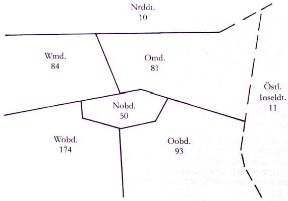
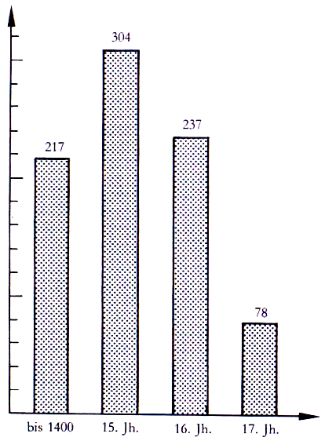
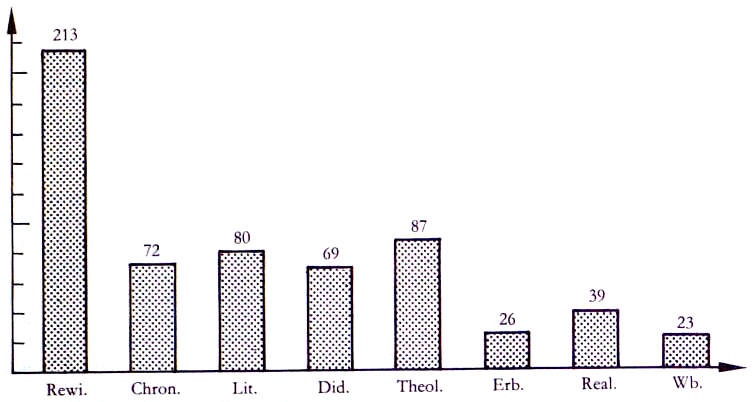

##6\. Die Quellen des Wörterbuches
Für die Herausgeber stand von vornherein fest, daß das Wörterbuch sich auf ein Quellencorpus zu stützen habe; sie vertreten das Corpusprinzip. Sie sahen allerdings keine Möglichkeit, ihre Stichwortliste und das zu beschreibende Bedeutungsinventar ausschließlich aus dem Corpus von Primärquellen, das heißt aus originalen Handschriften und Drucken bzw. aus diplomatischen Editionen oder Faksimiles, zu gewinnen, sondern meinten, sich aus arbeitstechnischen Gründen weitgehend auf solche Texteditionen beschränken zu müssen, deren lexikographische Erschließung insbesondere durch angehängte Ausgabenglossare vorbereitet ist. Inzwischen scheint den Herausgebern dasjenige, was 1976 noch als Zugeständnis an die Notwendigkeiten der Praxis aufgefaßt wurde, nicht nur von der Arbeitsmethode her voll berechtigt, sondern auch unter dem Gesichtspunkt des Anschlusses lexikographischer Information an Benutzungsanlässe und Benutzerfragen gut begründbar zu sein. Bevor dies näher (vgl. 6.3.4.5.) erläutert wird, soll eine Übersicht über die berücksichtigten Quellentypen, über die Weise ihrer Bearbeitung und über ihre Verteilung gegeben werden.

##6.1\. Die Quellentypen

6.1.1\. Die Ausgabenglossare

Zu dieser Gruppe gehören Glossare, Wortverzeichnisse, lexikologische Anmerkungsteile, Register aller Art im Anhang wissenschaftlicher Textausgaben (deshalb _Ausgaben_glossare genannt) des 19\. und 20\. Jahrhunderts. Als Beispiele seien die Glossare zu den Einzelbänden der Reihe _Sammlung Schweizerischer Rechtsquellen_ (vgl. im Verzeichnis der Quellen z. B. Nr. 383) oder in den _Österreichischen Weistümern_ (vgl. z. B. Nr. 309) genannt. Von diesen Glossaren wurden rund 470 erfaßt, davon genau 400 in einer 1977 erfolgten Sammlung, rund 70 als Ergänzung[^48] während der Bearbeitung der ersten Wörterbuchlieferung. Die Stichwörter der ersteren Gruppe wurden im Laufe der Jahre 1977 und 1978 von R. R. Anderson und U. Goebel elektronisch gespeichert. Computerausdrucke (die der Forschung auf Anfrage allgemein zur Verfügung stehen) liegen in Blacksburg/Virginia, Heidelberg und Lubbock/Texas. Sie enthalten auf rund 13 000 Seiten insgesamt rund 250 000 Einträge, allerdings nicht lemmatisierte, d. h. auf eine bestimmte Grund- und Regelform zurückgeführte Wörter, sondern deren in den Ausgabenglossaren angesetzte (höchstens teillemmatisierte) Schreibungen. Im _Verzeichnis der Quellen_ werden die elektronisch erfaßten Glossare von denjenigen der Ergänzungsgruppe unterschieden (vgl. S. 165).

6.1.1.1\. Die Ausgabenglossare sind als Verständnishilfe bei der Lektüre und philologischen Behandlung des edierten Textes gedacht. Sie enthalten dementsprechend nur diejenigen Wörter/Wortschreibungen, die dem Herausgeber unter irgendeinem Aspekt als erläuterungsbedürftig erschienen. Es können graphematische, wortgeschichtliche, -geographische, -soziologische, pragmatische, semantische Aspekte oder auch solche autor- oder textsortenbezüglicher Kennwortforschung sein. Die Auswahlkriterien schwanken von Glossar zu Glossar; oft ist das Faktum, daß ein Wort in einem Bezugswörterbuch (meist Lexer, Benecke/Müller/Zarncke oder das DWB) ganz oder in einer bestimmten Bedeutung fehlt, für die Aufnahme verantwortlich, oft ist es seine vom mittelhochdeutschen oder neuhochdeutschen Gebrauch abweichende Verwendung. (Auch die Anlage der Glossare schwankt erheblich: manchmal sind es reine Stichwortlisten mit Verweisen auf Textstellen, häufig werden ausführliche semantische und kulturgeschichtliche Erläuterungen gegeben. Entsprechend unterschiedlich ist der Umfang der Glossare; einige tendieren zu Vollständigkeit, andere umfassen nur wenige Druckseiten. Die Lemmata sind einmal nach dem klassischen Mittelhochdeutschen, einmal in einer Graphie des Frühneuhochdeutschen, einmal in neuhochdeutscher Orthographie angesetzt).

6.1.1.2\. Die Ausgabenglossare sind aus den genannten Gründen auch zusammengenommen nicht in der Lage, dem Lexikographen dasjenige zu bieten, was man als den _Allgemeinwortschatz_ des Frühneuhochdeutschen bezeichnen könnte. Sie sind durchgehend idiotismenlastig[^49], damit eher die editionsphilologischen Analoga zu den Idiotika der älteren Mundartlexikographie als zu den umfassenden dialektologischen Wortschatzdarstellungen des 20\. Jahrhunderts (man vgl. als Beispiel das _Rheinische Wörterbuch_). Wörter wie _agen_ ›Spreu‹, _guft_ ›Prahlerei‹ usw. findet man hier durchgehend, ebenso regellose Schreibungen; Partikeln wie _hin, her,_ Funktionswörter wie _aber, doch,_ aber auch Nennwörter wie _Haus, gehen, schön, schnell_ usw. erscheinen oft überhaupt nicht oder nur in irgendeiner besonderen Bedeutung. Es kommt hinzu, daß die Ausgabenglossare für die einzelnen Varietäten des Frühneuhochdeutschen in unterschiedlicher Dichte vorliegen. Das Oberdeutsche ist besser vertreten als das Mitteldeutsche, innerhalb des Oberdeutschen das Westoberdeutsche, besonders das Hochalemannische, besser als das Ostoberdeutsche. Die Texte der älteren Jahrhunderte des Frühneuhochdeutschen sind durchgehend ausführlicher aufbereitet als diejenigen nach der Reformation; besonders im 17\. Jahrhundert gehen Zahl und Umfang der Ausgabenglossare stark zurück. Theologische Prosa und didaktische Texte haben eine insgesamt gediegenere Aufarbeitung erfahren als fachliche Texte. Vor allem fehlen Glossare zum Gesamtwerk herausragender Persönlichkeiten (zum Beispiel zu Geiler von Kaisersberg, Murner, Brant, Paracelsus, Zwingli).

6.1.1.3\. Wenn die Herausgeber den Wert der Ausgabenglossare trotz alledem sehr hoch veranschlagen, so hat dies folgende Gründe: Die Ausgabenglossare liegen in großer Zahl vor, sie liefern einfach auf Grund ihrer Masse ein Wort- und Bedeutungsmaterial von erheblichem Umfang. Was soeben im Hinblick auf den Allgemeinwortschatz negativ gewertet wurde, ist unter varietätenbezüglichem Aspekt positiv zu sehen. Grob varietätengebundene Wörter, das sind genau diejenigen, die vom Wörterbuchbenutzer zur Feststellung ihrer Symptomwerte sowie zur Behebung semantischer Verständnisschwierigkeiten bei der Textlektüre, vor allem zur Behebung von Wortlükken und von Wortbedeutungslücken nachgeschlagen werden müssen (vgl. 4.3.2.2.), erscheinen mit einiger Wahrscheinlichkeit in den Ausgabenglossaren. Für den Lexikographen sind diese Glossare auch deshalb von Bedeutung, weil sie von den Textherausgebern, im Normalfall also von den besten Kennern der Texte, erarbeitet wurden und daher oft diejenige detaillierte und zuverlässige Sachinformation liefern, die für das sprachliche Verständnis der Texte als Voraussetzung für ihre sprachwissenschaftliche Beschreibung notwendig ist. Einige Beispiele aus Winters Ausgabe der _Niederösterreichischen Weistümer_ (Quelle Nr. 534, Bd. 4) sollen dies kurz veranschaulichen:

_abfreien_ den Abgang von einem Gute durch Entrichtung der Gebühr rechtskräftig machen (S. 601).

_abstraifen_ Rebschößlinge so durch die Erde biegen, daß sie auf einem andern Grunde weiterwachsen (S. 602).

_abtrettung_ f., _abtrit_ m. heißt das Verlassen des Taidings, das den Teilnehmern für eine Pause gestattet wird, damit sie sich beraten können (S. 603).

Die unter 12.4.3\. konstatierte Überforderung des Lexikographen wird durch solche Information gemildert.

6.1.2\. Indices verborum und Konkordanzen

Diese Quellengruppe hat zusammen mit den zeitgenössischen Glossaren die Aufgabe, die Idiotismenlastigkeit der Ausgabenglossare zugunsten des Allgemeinwortschatzes zu korrigieren und dem Wörterbuchbenutzer dadurch Antwort auf all diejenigen Fragen zu ermöglichen, die auf einzelne Bedeutungsschattierungen und vor allem auf die strukturellen Zusammenhänge des Lexikons zielen. Sie vermögen dies vom Typ her deshalb zu leisten, weil sie im Unterschied zu den Ausgabenglossaren alle im Quellentext verwendeten Wörter enthalten, also auch diejenigen, die (vermeintlich) keine Verständnisschwierigkeiten bereiten. Ob sie ihre Aufgabe allerdings auch in der Praxis erfüllen können, hängt entscheidend mit ihrer Anzahl und ihrer Verteilung über die Varietäten zusammen. Im Hinblick darauf neigten die Herausgeber von Anfang an zur Skepsis. Abgesehen von ihrer insgesamt geringen Anzahl liegen sie oft als (halb)private Computerausdrucke vor, sind also bibliographisch nicht mit Sicherheit zu erfassen und, falls sie erfaßt sind, nicht im Buchhandel erhältlich (die Hilfsbereitschaft und Freundlichkeit der Index- und Konkordanzbearbeiter hat diesen Mangel allerdings in allen Fällen beheben lassen). Anfangs meinten die Herausgeber, die in einem Raster von Dialekt/Historiolekt/Soziolekt/Textsorte vorhandenen groben Lükken in der Verteilung von Indices und Konkordanzen durch eigene Zusammenstellungen zumindest ansatzweise auffüllen zu können. Vor allem die damit verbundene Lemmatisierungsmühe hat sie bescheiden werden lassen: Nur die _Heidin_ (Quelle Nr. 201), der _Roman von der Königin Sibille_ (Quelle Nr. 482), die _Mörin_ Hermanns von Sachsenheim (Quelle Nr. 300), _Der meide kranz_ Heinrichs von Mügeln (Quelle Nr. 219) und einige _Flugschriften_ der Zeit von 1520 bis 1525 (Quelle Nr. 7) ließen sich (mit jeweils partiell wechselnden Bearbeitern) fertigstellen. Angesichts dieser Lage war es eine entscheidende Hilfe, daß die Bonner Forschergruppe um das Projekt _Grammatik des Frühneuhochdeutschen_ den Herausgebern des _Frühneuhochdeutschen Wörterbuches_ einen nichtlemmatisierten Index von 40 Texten zu jeweils 30 Normalseiten anbot. Allen Mitarbeitern des Projektes, vor allem Herrn Kollegen Besch, sei für ihre kollegiale Hilfe auch hier herzlich gedankt. Zusammen mit dem Bonner Corpus besteht die Quellengruppe der Indices[^50] und Konkordanzen inzwischen aus folgenden 62 Nummern des Quellenverzeichnisses: 1; 5; 7; 8; 31; 45; 60; 73; 88; 97; 106; 109; 112; 116; 117; 133; 139; 141; 170; 177; 181; 188; 195; 201; 206; 219; 225; 241; 266; 271; 272; 282; 300; 301; 310; 311; 319; 320; 328; 329; 338; 361 a; 363, 364; 374; 376; 398; 399; 408; 416; 420; 426; 427; 440; 445; 450; 480; 482; 516; 518; 527; 530.

6.1.3\. Zeitgenössische Glossare

Die zeitgenössischen Glossare sind nach der überragenden, wenn auch mit Mängeln behafteten Leistung Lorenz Diefenbachs in der Mitte des 19\. Jahrhunderts erst in den vergangenen beiden Jahrzehnten wieder mit einiger Systematik zum Forschungsgegenstand geworden[^51]\. Wie immer man ihre Entstehung und wechselseitige Abhängigkeit, ihre räumliche Bindung und ihre pragmatische Rolle im einzelnen bestimmt, sie sind in ihrer Entstehung stark von lateinischen Vorlagen abhängig und enthalten dementsprechend sehr viele Lehnbildungen zum Teil an der außerlexikographischen Sprachrealität des Frühneuhochdeutschen vorbei; sie haben eine weitgehend oberdeutsche Entstehungsbasis; und sie fungieren als kulturvermittelnde Texte innerhalb des spätmittelalterlichen und frühneuzeitlichen Wissenschaftsbetriebes, der Kirche und zum Teil der Justiz, in den beiden letzten Bereichen auch als Hilfsbücher für die Rhetorik. Der in den zeitgenössischen Glossaren kodifizierte Wortschatz ist infolge des schreib- und druckersprachlichen Filters, der grobe Dialektalismen aussondert, nur gemäßigt landschaftsgebunden; er erfüllt gegen Ende der Epoche sogar eine der Tendenz nach normsprachliche Ausgleichsfunktion; er gehört schichten- und gruppensoziologisch wie von seiner pragmatischen Rolle her zum Sprachbestand der mittleren bis gehobenen Bildungsschichten und vermag mit all diesen Kennzeichen insgesamt ebenfalls zur Korrektur der Idiotismenlastigkeit der Ausgabenglossare beizutragen. Während die Indices und Konkordanzen allerdings alle Wörter enthalten und durch die immer beigefügten Häufigkeits- und Belegangaben auch die Verwendung der Funktionswörter zu beschreiben ermöglichen, sind die zeitgenössischen Glossare eher als Quelle für die drei Nennwortarten zu betrachten.

Der Wortschatz von 15 zeitgenössischen Glossaren wurde zusammen mit dem deutschen Wortbestand von Diefenbachs _Glossarium Latino-Germanicum_ von R. R. Anderson und U. Goebel nach einem bestimmten Auswahlverfahren elektronisch erfaßt und alphabetisiert; es sind die folgenden Nummern des _Verzeichnisses der Quellen: 4;_ 10; 61; 102; 172; 299; 339; 355; 400; 437; 494; 499; 500; 501; 507\. Der entstehende Index enthält auf 7325 Seiten rund 140 000 originale lexikographische Lemmaansätze von natürlich sehr viel weniger Wörtern, aber mit sehr viel mehr Stellenhinweisen. Er steht wie der Index der Ausgabenglossare der Forschung auf Anfrage allgemein zur Verfügung. Nicht elektronisch gespeichert, aber bei der Bearbeitung des ersten Bandes systematisch exzerpiert wurden die Nummern 98; 101; 200; 216; 420; 427; 441 des Quellenverzeichnisses. Der Ausschluß dieser Glossare aus der elektronischen Alphabetisierung ergibt sich aus den unter 6.2.2.3\. vorgetragenen Gründen.

6.1.4\. Sekundäre Quellen

Zu den sekundären Quellen zählen lexikologische Untersuchungen, Wörterbücher, Sachregister zu Texteditionen, Sachlexika, und zwar jeweils insofern, als sie frühneuhochdeutsche Textbelege enthalten. Auch einige Ausgabenglossare, die als Primärquelle nicht systematisch aufbereitet werden konnten, sollen hier zu den Sekundärquellen gerechnet werden, die damit eine Restkategorie bilden.

Der Teil „lexikologische Untersuchungen“ der Sekundärquellen war bei der Konzeption des Wörterbuches als eine eigene Quellengruppe angesetzt worden und hat deshalb eine besondere alphabetische Sortierung erfahren, sofern jedenfalls das behandelte Wortgut in einem Register zu den betreffenden Untersuchungen zusammengestellt war. Der entstandene Computerausdruck ist 3252 Seiten stark und enthält rund 60 000 Einträge von lexikologisch behandelten Einheiten. Bei der Bearbeitung des ersten Bandes stellte sich heraus, daß dieses Register nicht nur vom Umfang her gegenüber den Registern zu den Ausgabenglossaren und zu den zeitgenössischen Glossaren stark abfällt, sondern auch qualitativ nur von eingeschränktem Wert ist, vor allem deshalb, weil oft keine exakten Belegangaben gemacht werden oder weil die Belegangaben nichtedierten Quellen entstammen. Dies war der Grund, die lexikologischen Untersuchungen aus dem Verzeichnis der (primären) Quellen herauszuhalten und sie statt dessen im Verzeichnis der Sekundärliteratur aufzuführen, und zwar ohne sie besonders zu kennzeichnen.

Den aufschlußreichsten Teil der Sekundärquellen bilden zweifellos die Wörterbücher; danach folgen mit einigem Abstand die Sachregister und der erwähnte Rest der Ausgabenglossare. Innerhalb der Wörterbücher erwiesen sich – abgesehen von der Neubearbeitung des _Deutschen Wörterbuches_ der Brüder Grimm, die auf einem beneidenswerten Quellenstand beruht[^52] – die historischen Dialektwörterbücher als äußerst ergiebig. Einen hohen Wert hat vor allem der fertiggestellte Teil des _Altkölnischen Sprachschatzes_ von Adam Wrede.

##6.2\. Die Quellenbearbeitung

6.2.1\. Der Wert alphabetischer Wort- oder Schreibformenlisten für den Lexikographen besteht darin, daß sie, von einigen Schwierigkeiten einmal abgesehen, grob zu erkennen geben, welche Wörter ins Wörterbuch aufgenommen werden können, wo diese Wörter belegt sind und (unter Voraussetzung des lexikographischen, sprachlichen und kulturellen Vorwissens des Wörterbuchbearbeiters) zu welchen anderen Wörtern semantische Verwandtschaftsbeziehungen bestehen könnten. Dies alles sind Positiva; sie dürfen jedoch nicht darüber hinwegtäuschen, daß alle Listen zusammen lediglich als Voraussetzung für die lexikographische Arbeit fungieren können, die im eigentlichen Sinne des Wortes also erst nach der Erstellung der Wortlisten beginnt.

6.2.2\. Lexikographische Arbeit ist zum großen Teil Exzerption von Quellen. Sie betraf die einzelnen Quellentypen wie folgt:

6.2.2.1\. Die Stichwörter der Ausgabenglossare wurden systematisch und ohne Ausnahme erfaßt; falls sich beim Exzerpieren zeigte, daß ein bestimmtes, in einem Ausgabenglossar sehr oft belegtes Wort immer wieder in gleicher Bedeutung begegnet, wurden nicht alle im Ausgabenglossar angegebenen Belegstellen ausgeschrieben. Die Entscheidung, wann genau die Exzerption der Belege eines Wortes für die Einzelquelle abgebrochen wurde, läßt sich nicht in Regeln fassen; sie unterliegt dem Urteil des Lexikographen, wird deshalb sicher in vielen Fällen vorschnell erfolgt sein. Es sind Zeitgründe, die eine solche Risikonahme rechtfertigen müssen: Wenn ein Wort in einer Quelle fünfmal in einem stereotypen Kontext begegnet, ist es nicht sinnvoll, weitere zwanzig Belege zu exzerpieren, auch wenn nie auszuschließen ist, daß der letzte Beleg etwas Neues bringt. – Außer den Stichwörtern der Ausgabenglossare wurden einige weitere Wörter aus der betreffenden Quelle herausgeschrieben, und zwar solche, die in der Umgebung des gerade exzerpierten Stichwortes vorkommen und dem Lexikographen aus irgendeinem Grunde ins Auge fielen. Insgesamt ist die auf letztere Weise gewonnene Menge von Exzerpten wesentlich geringer als die Zahl der Exzerpte nach dem Glossarstichwort. – Die Gruppe der Ergänzungen der Ausgabenglossare wurde nicht durchgehend nach den Glossarstichwörtern exzerpiert; die Auswahl erfolgte in der Weise, daß der Bearbeiter das betreffende Glossar durchsah, nach seiner Vermutung von Lücken die zu exzerpierenden Lemmata kennzeichnete und anschließend ausschrieb. Zu besonderen Verdichtungen der Exzerptionstätigkeit vergleiche man 6.3.4.4.

6.2.2.2\. Bei den Indices und Konkordanzen stellt sich das Selektionsproblem, das für die Ausgabenglossare trotz des soeben Vorgetragenen insgesamt nur eine periphere Rolle spielt, in wesentlich schärferer Weise. Die Schwierigkeit besteht darin, daß dieser Quellentyp vor allem eine Korrektur der Idiotismenlastigkeit der Ausgabenglossare zum Allgemeinsprachlichen hin leisten soll und daß insofern alle vermeintlich oder tatsächlich unproblematischen Wörter quantitativ ausgiebig exzerpiert werden müßten, daß aber Zeit- und Effektivitätsgründe eine Auswahl unumgänglich machen. Auch hier ist das Urteil des Lexikographen, das unter Berücksichtigung der besonderen Funktion der Quellengruppe und in Kenntnis des Exzerptionsstandes einen vernünftigen Mittelweg zwischen dem quantitativ Notwendigen und bloßem Zeitverschleiß zu suchen hat, nicht durch eine generelle Arbeitsanweisung zu ersetzen. Dies heißt natürlich auch, daß der Lexikograph jederzeit die volle Quantität des bearbeiteten Wortmaterials durchschauen und eine Übersicht über die Bedeutungen der Wörter haben muß. Die Delegation der Exzerptionsarbeit an zeitweilig Mitarbeitende, z. B. an Hilfskräfte (vorausgesetzt, sie seien vorhanden), findet hier und an vielen anderen Stellen ihre Grenze. – Von den geschilderten arbeitsmethodischen Problemen zu unterscheiden ist folgende Gegebenheit der faktischen Exzerptionssituation: Die Quellen des Bonner Corpus standen dem Bearbeiter erst nach Fertigstellung des Wörterbuchmanuskriptes _a_ bis _abzwingen_ zur Verfügung und konnten für diese Strecke deshalb nur noch mit einigen wenigen Einzelexzerpten berücksichtigt werden.

6.2.2.3\. Zu den zeitgenössischen Glossaren wurde oben gesagt (6.1.3.), daß ihr Wortschatz nach einem bestimmten Auswahlverfahren elektronisch sortiert worden sei. Diese Aussage bedarf hier der Präzisierung und Erklärung: Aufgenommen wurden

– bei lateinisch-deutschen Glossaren jeweils die hinter dem lateinischen Lemma stehenden heteronymischen und partiell heteronymischen[^53] Bedeutungserläuterungen

– bei sachlicher Anordnung alle für die einzelnen Begriffspositionen angegebenen deutschen Wörter

– bei alphabetischer Anordnung von Wortfeldern die jeweiligen Archilexeme[^54] und alle daran anschließend aufgeführten Feldangehörigen

– bei alphabetischer deutsch-deutscher Anordnung die synonymischen und partiell synonymischen Erläuterungen.

Umgekehrt ausgedrückt: Nicht aufgenommen wurden die alphabetisch angeordneten Lemmata deutsch-deutscher Glossare (also z. B. Maaler), da diese ja ohnehin rasch zugänglich sind, sowie diejenigen Glossare, die (wie z. B. Schöpper) in einer neuzeitlichen Edition vorliegen, der ein alphabetisches Register beigegeben ist. Dasypodius, Serranus, Hulsius und das Dictionarium Germanico-Gallico-Latinum blieben auch hinsichtlich ihres beschreibungssprachlichen Wortschatzes ausgeschlossen; dieser ist vor allem im Vergleich zu demjenigen Maalers nämlich auf den ersten Blick als unergiebig zu erkennen. Im übrigen hat sich die Erwartung, daß der beschreibungssprachliche Wortschatz beim Vocabularius Teutonico-Latinus und bei Maaler Einheiten enthält, die selbst nicht als Lemmata erscheinen, nur in bescheidenem Maße erfüllt, ein Ergebnis, das die These von der Entstehung deutsch-deutscher Wörterbücher aus deutsch-lateinischen und letzterer aus lateinisch-deutschen (nämlich durch bloße Umkehrung) erhärtet.

6.2.3\. Aus dem Vorgetragenen ergeben sich die Exzerptionsentscheidungen: Exzerpiert werden alle Einträge der Computerliste, es sei denn, daß bei Vielfachbelegungen wieder eine Einschränkung im Hinblick auf die Anzahl der Belegstellen erfolgte; exzerpiert wurden ferner alle alphabetisch geordneten Lemmata aller unter 6.1.3\. genannten zeitgenössischen Glossare.

6.2.4\. Die sekundären Quellen enthalten – hier sei ein Teilergebnis der kritischen Prüfung des Corpus (vgl. 6.3.) schon einmal vorweggenommen – beachtenswertes in den eigenen Quellen nicht vorhandenes oder durch den Zugang über die (natürlich immer unvollständigen) Ausgabenglossare nicht erschlossenes Wortgut und vor allem nicht erschlossene Bedeutungen. Insbesondere sei auf folgende systematisch durchgesehene Wörterbücher als den ergiebigsten Teil der Sekundärquellen verwiesen: DWB; Trübner, Dt. Wb.; Dief./Wü.; RWB; Schulz/Basler; Veith, Bergwb.; Jones, French Borrowings; Wrede, Aköln. Sprachsch.; Preuß. Wb. (Z); Ohess. Wb.; Pfälz. Wb.; Schles. Wb.; Bad. Wb.; Martin/Lienhart; Schwäb. Wb.; Vorarlberg. Wb.; Öst. Wb. (Auf systematische Durchsicht des Schweiz. Id. und von Schmeller/F. mußte wegen deren Anordnungsprinzips aus Zeitgründen verzichtet werden).

Es stellt sich die Frage, wie man sich angesichts der Ergiebigkeit der Sekundärquellen zu verhalten hat.

Für die Wörterbücher (als den ergiebigsten Teil der Sekundärquellen) ist einerseits zu beachten, daß man deren Belege nicht einfach übernehmen und ungekennzeichnet in die eigenen Wörterbuchartikel übernehmen kann. Sie unter Angabe des Wörterbuches einzubeziehen, hätte das sonstige Zitierschema (mit Nennung der Primärquelle sowie Raum- und Zeitangabe, vgl. 17.2.) durchbrochen; die im Wörterbuch angegebene Quelle zu übernehmen und dem Literaturschema zu unterwerfen, hätte umfängliche Verifizierungen und in aller Regel eine eigene Raum- und Zeitbestimmung der Quelle erfordert (da diese in den Wörterbüchern nur unvollkommen geleistet ist), wäre im übrigen typisches Spicken gewesen. Andererseits schreibt man ein Wörterbuch, um einem Benutzer, dem autorenrechtliche Fragen völlig gleichgültig sind, das größtmögliche Maß an Information im ersten Nachschlagegriff zu bieten. Der Kompromiß zwischen lexikographischer Ehrlichkeit, Informationswillen gegenüber den Benutzern und einem gewissen Stolz auf das eigene Quellencorpus sieht wie folgt aus: Wörter, die im eigenen Corpus begegnen, aber wegen des Zugangs über die Ausgabenglossare nicht erschließbar waren, wurden exzerpiert und an der eigenen Quelle verifiziert, aber nur dann als Lemmata angesetzt, wenn sie die Bedingung erfüllten, entweder Simplicia oder aber nach einem nicht näher erläuterbaren Offensichtlichkeitskriterium wirklich informativ zu sein. Für nicht erschlossene Wortbedeutungen wurde ähnlich restriktiv verfahren. Simplicia, die nicht im eigenen Corpus belegt sind, wurden ohne Ausnahme, nicht belegte Komposita, Ableitungen und mitteilenswerte Wortbedeutungen hingegen wieder nur eingeschränkt aufgenommen. In diesen Fällen unterscheidet sich der Belegnachweis von dem Nachweis der Belege des eigenen Corpus: Es wird lediglich – und zwar in der Artikelposition ‚Literaturhinweise‘ (vgl. 20.) – auf die Wörterbuchstelle verwiesen, die den Beleg enthält, vgl. zum Beispiel: _abbeile_ mit dem Verweis auf das _RW B_ (_Deutsches Rechtswörterbuch_), aber ohne die sonst übliche Wiedergabe des Beleges und ohne Zeit- und Raumbestimmung, wie sie für die eigenen Belege die Regel ist. – Die Neubearbeitung des _Deutschen Wörterbuches (DWB)_ der Brüder Grimm stellt wie schon die zuletzt bearbeiteten Strecken seiner ersten Auflage in mancher Hinsicht einen Sonderfall dar. Ihr Quellenbestand überragt denjenigen des _Frühneuhochdeutschen Wörterbuches (FWB)_ um ein Vielfaches. Deshalb mußte in unterschiedlicher Weise verfahren werden: Für Wörter und Wortbedeutungen aus dem dem DWB und FWB gemeinsamen Corpusteil gelten die soeben generell für die Sekundärquellen formulierten Auswertungsrichtlinien. Wörter und Wortbedeutungen dagegen, die dem nur dem DWB eigenen Corpus entstammen, bleiben unberücksichtigt. Eine andere Entscheidung hätte bei der Fülle des Wortmaterials des DWB und bei dem Feinheitsgrad seiner semantischen Ausdifferenzierung insbesondere für die allgemeinsprachlichen (vgl. 6.3.3.4.) Wortschatzteile zu störenden Verweishäufungen geführt; außerdem hätte ein gewisses Ungleichgewicht auf Grund des Faktums in Kauf genommen werden müssen, daß der von der Berliner Arbeitsstelle betreute Teil der Neubearbeitung erst von _a_ bis _affrikata_, der in Göttingen betreute Teil erst von _d_ bis _D-Zug_ gediehen ist. – Die hier vorgetragene Verfahrensentscheidung enthält natürlich so etwas wie die Anerkennung, daß die Neubearbeitung des DWB von der Materialfülle her gesehen das beste frühneuhochdeutsche – vielleicht auch das beste mittelhochdeutsche und mittelniederdeutsche – Wörterbuch ist. Der Benutzer wird also immer dann, wenn er im FWB keine Antwort findet, eine solche mit Aussicht auf Erfolg im DWB (Neub.) suchen können. Es sei ausdrücklich gesagt, daß das FWB die Neubearbeitung des DWB auch für das 14\. bis 17\. Jahrhundert nicht vollständig zu ersetzen in der Lage ist. Umgekehrt gilt diese Aussage natürlich ebenfalls, und zwar schon deshalb, weil die Neubearbeitung des DWB nur für die Strecke von a–f geplant ist und sich bei dem bisherigen Publikationstempo durchaus bis zum Jahre 2030 hinziehen könnte.

Derjenige Teil der Sekundärquellen, die nicht zu den Wörterbüchern gehören, wird der Tendenz in der Behandlung der Wörterbücher entsprechend ebenfalls nur restriktiv berücksichtigt. Die Entscheidung, wann ein Lemma, eine Bedeutung, ein Beleg, eine sonstige Information wiedergegeben wird, unterliegt dem Urteil des Lexikographen. Diese offene Formulierung soll die Möglichkeit bieten, selbst zufällig dem Lexikographen vorliegende Information weiterzugeben, vgl. im Artikel _abgot_ unter Bedeutungsposition 3 den aussagekräftigen Beleg aus dem werkgeschichtlichen Anhang zu Reitz, _Historie der Wiedergebohrnen._

##6.3\. Kritische Prüfung des Corpus

Ein Wörterbuch, das idealiter das gesamte Varietätenspektrum einer historischen Sprachstufe zum Gegenstand hat, wird sich fragen lassen müssen, wie weit dieses Ziel in der Praxis erreicht wurde. Dies erfordert eine Aufschlüsselung der Quellen nach den drei wichtigsten Heterogenitätsdimensionen ‚Zeit‘, ‚Raum‘, ‚Textsorte‘; mit dem Textsortenbegriff soll auch die schichten- und gruppensoziologische sowie die situative Dimension des Spektrums frühneuhochdeutscher Varietäten als berücksichtigt gelten. – Die Aufschlüsselung erfolgt ohne Gewichtung der einzelnen Quellentypen, des Umfangs der Quelle und (im Falle der Ausgabenglossare) ihrer Ausrichtung und ihrer Qualität. Dadurch kommen sicher erhebliche Verzerrungen zustande; sie sollten aber nicht als Alibi dazu dienen, auf die Quellenaufschlüsselung überhaupt zu verzichten. Insgesamt meinen die Herausgeber, daß der Überblick ein hinreichend zuverlässiges und aufschlußreiches Bild vermittelt. – Die Zahlen der unten folgenden Zusammenstellungen beziehen sich auf die Nummern im _Verzeichnis der Quellen._ In Klammern gesetzte Zahlen besagen, daß die jeweilige Raum-, Zeit- oder Textsortenzuordnung nur für Teile des Quellentextes oder nur unter Teilaspekten gilt. Fehlende Quellennummern ergeben sich dadurch, daß eine Raum-, Zeit- oder Textsortenzuordnung nicht möglich oder nicht sinnvoll ist.

6.3.1\. Die sprachräumliche Verteilung der Quellen

Als Bezugsgröße für die sprachräumliche Aufschlüsselung der Quellen gilt nach dem in Abschnitt 13.1.1\. Erläuterten die Gliederung des deutschen Sprachgebietes in die Großräume Norddeutsch, Westmitteldeutsch, Ostmitteldeutsch, Nordoberdeutsch, Westoberdeutsch, Ostoberdeutsch, östliches Inseldeutsch. Man vgl. außer dem nebenstehenden Raumschema (Abb. 5) auch die Karte zu Abschnitt 13.1.1.3 (S. 119).

| Nrddt. | 48; 58; 74; 89; 179; 197; 198; 241; 268; 427. |
| --- | --- |
| Wmd. | 4; 5; 6; 10; 13; 14; 36; 38; (49); 52; 60; 66; 70; 86; 87; 88; 90; 97; 114; 115; 143; 144; 145; 146; 147; 174; 175; 176; 177; 189; 202; 207; 226; 227; 230; 235; 242; 245a; 252; 258; 262; 265; 269; 270; 273; 286; 287; 305; 306; 330; 345; 353; 365; 374; 379; 380; 399; 404; 405; 409; (411); 415; 416; 418; 421; 422; 430; 433; 437; 445; 448; 461; 469; 470; 471; 472; 473; 482; 494; 499; 529; 537; 545; 546. |
| Omd. | 33; 34; 39; 41; 42; 44; 75; 117; 128; 129; 130; 131; 132; 138; 156; (160); 167; 168; 169; 170; 178; 183; 199; (203); (204); 218; 219; 223; 225; 231; 237; 243; 246; 263; 277; 279; 282; 284; 288; 290; 292; 293; 294; 295; 296; 301; 318; 325; 339; 341; 348; 349; 352; 373; 396; 417; 420; 426; 440; 446; 458; 464; 468; 477; 479; 480; 481; 485; 486; 514; 515; 518; 521; 522; 539; 542; 543; 549; 550; 551; 552. |
| Nobd. | 12; 31; 37; 45; 72; 91; 92; 93; 94; 104; 106; 107; 109; 127; 135; 136; 157; 159; 185; 191; 192; 201; 211; 216; 234; 236; 245; 249; 266; 280; 303; 319; 323; 324; 340; (359); 368; 381; 406a; 407; 423; 424; 435; 436; 441; 453; 501; 512; (520); 525. |
| Wobd. | 2; 3; 8; 9; 11; 16; 17; 18; 19; 20; 21; 22; 23; 25; 30; 35; 40; 43; (49); 51; 53; 54; 55; 56; 59; 61; 62; 64; 67; 68; 71; 76; 77; 78; 79; 80; 81; 82; 83; 84; 95; 96; 98; 100; 101; 103; 105; 112; 116; 118; 119; 133; 141; 149; 150; 152; 153; 154; (160); 161; 162; 163; 165; 172; 173; 182; 187; 188; 190; 193; 194; 195; 200; 206; 208; 214; 217; 221; 222; 228; 238; 239; 240; 244; 251; 254; 255; 256; 257; 260; 261; 271; 272; 276; 283; 285; 291; 298; 299; 300; 310; 311; 312; 313; 314; 315; 316; 317; 322; 326; 327; 328; 331; 332; 333; 334; 335; 336; 337; (343); 347; 350; 351; 357; 360; 361; 364; 366; 370; 375; 376; 383; 384; 385; 386; 387; 388; 389; 391; 392; 394; 395; 398; 400; 406; 408; (411); 412; 413; 425; 434; 438; (443); 447; 454; 455; (463); 484; 491; 495; 497; 498; 500; 502; 503; 508; 513; 523; 524; 527; 530; 535; 536; (553). |
| Oobd. | 1; 15; 24; 26; 27; 28; 29; 32; 46; 47; 57; 65; 69; 73; 85; 99; 108; 110; 113; 121; 124; 125; 139; 148; 151; 155; 158; 180; 184; 186; 205; 209; 210; 220; 229; 250; 259; 264; 267; 274; 275; 304; 308; 309; 320; 329; 338; (343); 344; 354; 355; 358; (359); 367; 382; 393; 401; 402; 403; 432; 439; 442; (443); 444; 449; 450; 451; 456; 457; 459; 462; (463); 466; 475; 476; 487; 488; 489; 490; 492; 504; 505; 506; 511; 516; 517; 519; (520); 528; 534; 540; 544; (553). |
| Inseldt. | 63; 111; 181; 321; 361 a; 362; 363; 369; 377; 378; 397. |

Abb. 4: Die sprachräumliche Verteilung der Quellen

6.3.2\. Die zeitliche Verteilung der Quellen

Da eine Gliederung des Frühneuhochdeutschen nach kommunikationsgeschichtlichen Teilepochen als Bezugsgröße für die zeitliche Aufschlüsselung der Quellen nicht möglich ist (vgl. 13.1.2.), wird hier nach Jahrhunderten gegliedert.

Abb. 5: Die Raumverteilung der Quellen in sprachgeographischer Veranschaulichung.

| 14\. Jh. | (3); (13); (14); 15; 25; (26); 27; 33; 34; (39); 42; 43; (44); (47); (53); (54); (55); (56); 57; (59); 60; 65; (66); (69); 73; (74); (75); (88); (95); (100); (102); (108); (110); 112; (115); 117; 118; 119; (120); (122); (128); (129); 130; (131); (134); 138; 140; 143; (144); (148); (151); (154); 156; (167); (168); (169); (173); 183; 184; 188; 189; (194); (196); 197; 198; 201; 202; (203); 205; (207); (208); (209); (211); 215; 217; (218); 220; (223); 224; (227); (228); 231; (233); (238); (239); (240); 243; 244; (247); (252); 254; (263); (265); (269); (270); 272; 276; 277; (286); (287); (298); (309); (312); (313); (314); (315); (316); (318); 319; 322; (323); 325; 326; 327; 330; (331); (334); (336); 342; 350; 351; 352; 358; (359); 363; 364; 365; 367; 368; (369); 371; 372; (375); (377); (380); (383); (384); (385); (386); (387); 391; 392; (395); 397; 402; (404); (409); (413); 416; (417); (418); (419); 423; (424); (425); 426; (429); (430); 433; (434); (435); 436; (442); (444); 445; 450; (453); 455; (456); (457); (460); 462; (463); 464; 465; 468; (469); (470); (471); (472); (473); (475); (476); (485); 486; 489; 490; (491); (492); 496; 497; (502); 505; (506); (514); (515); 519; (523); (524); (525); 526; 529; (531); (532); (533); (534); (535); (536); 541; (542); (544); 545; 546; (549); (550); (551); 552. |
| --- | --- |
| 15\. Jh. | (3); 6; 12; (13); (14); 18; 21; 22; 24; (26); 28; 29; 32; (39); (40); (44); (46); (47); 52; (53); (54); (55); (56); (59); 61; 62; 63; 64; (66); 67; 68; (69); 71; 72; (74); (75); 76; 78; (79); (85); 86; (88); 90; 91; 92; 93; (94); (95); 96; 97; (100); 102; 104; 105; (107); (108); (110); 111; 113; 114; (115); 116; (120); (122); (123); 125; (128); (129); (131); (134); 135; 136; 139; 141; 142; (144); 145; (148); (151); 152; (153); (154); 155; 157; 158; 159; 162; 163; (167); (168); (169); (173); 175; 176; 178; 179; 180; 182; 185; 190; (191); (194); (196); 199; (203); (204); 206; (207); (208); (209); 210; (211); 212; 213; (218); 219; 221; 222; (223); 225; (227); (228); 229; 230; (232); (233); 234; (239); (240); 242; 245; (247); 250; 251; (252); (257); 259; 260; (263); (264); (265); 266; 267; (269); (270); 274; 275; 280; 282; 283; (284); (286); (287); (290); 297; (298); 300; 302; (303); 304; 305; 306; (309); 311; (312); (313); (314); (315); (316); (318); 320; 321; (323); 324; (331); (332); (333); (334); 335; (336); (337); 338; 340; 341; (343); 344; 347; 349; 353; 354; 355; 357; (359); (362); 366; (369); 370; 373; (375); (377); (379); (380); (383); (384); (385); (386); (387); (388); (395); 396; 401; 403; (404); 405; (406); 408; (409); (411); (413); 415; (417); (418); 419; 420; 422; (424); (425); 428; (429); (430); (434); 439; 440; (442); (443); (444); 451; 452; (453); 454; (456); (457); 458; 459; (460); 461; (463); (466); 467; (469); (470); (471); (472); (473); (475); (476); 477; 478; 479; 481; 482; 484; (485); (491); (492); (493); 495; 498; 499; 500; 501; (502); 503; 504; (506); 508; (509); 510; (511); 512; 513; (514); (515); 516; 517; 522; (523); (524); (525); 528; 530; (531); (532); (533); (534); (535); (536); (538); (542); (544); (549); (550); (551); 553. |
| 16\. Jh. | 2; 4; 7; 8; 9; 10; 11; (13); (14); 16; 17; 19; 20; 23; 30; 31; 36; (37); 38; (39); (40); 41; (46); (47); 49; 51; (53); (54); (56); 58; (59); (66); (69); 70; 77; (79); 80; 81; 82; 83; 84; (85); 89; (94); 98; 99; 101; 103; 106; (107); 109; (115); 121; (122); (123); 124; 126; (129); (131); 132; 137; 146; 149; 150; (151); (153); (154); 160; 164; 165; 166; (167); (168); (169); 171; 172; (173); 174; 177; (181); 186; 187; (191); 193; (194); (196); (204); (207); 214; 216; (218); 226; (227); (228); (232); 235; 237; (239); (240); 241; 245a; 246; (247); 248; 249; (252); 253; 255; 256; (257); 258; 261; 262; (263); (264); (269); (270); 271; 273; 279; 281; (284); 285; (286); 288; 289; (290); 291; 292; 293; 294; 295; 296; 299; 301; (303); 307; 308; (309); (312); (314); (315); 317; 329; (332); (333); (334); (337); 339; (343); (345); 360; 361; 361 a; (362); (369); 374; 376; (377); 378; (379); (380); 381; 382; (383); (384); (385); (387); (388); 390; 393; 394; (395); 398; 400; (404); (406); 406a; 407; 410; (411); 412; (413); (418); (419); 421; 427; (429); (430); 431; 432; (434); 437; 438; 441; (443); (444); 446; 447; 448; 449; (453); (456); (463); (466); (470); (471); 474; 480; 483; (485); 487; 488; (491); (493); 494; 507; (509); (511); (515); 520; 521; (523); (524); (525); 527; (531); (533); (534); (535); (536); (538); 540; (542); (543); (544); (549). |
| 17\. Jh. | 1; 5; (13); (14); 35; (37); 45; (47); 48; (53); (54); (55); (56); (66); (69); (107); 127; 133; (153); (154); 161; (169); 170; (173); (181); 192; (194); 195; (196); 200; (218); (227); (232); 236; (239); (240); (247); (252); (264); 268; (269); (270); (286); (290); (309); 310; (312); (314); 328; (333); (334); (345); 348; (369); (380); (383); (384); (385); (387); (388); (399); (404); (413); (418); (419); (429); (430); (444); (456); (463); (466); (470); (471); 518; (535); (537); (543); (544). |

Abb. 6: Die zeitliche Verteilung der Quellen

Abb. 7: Die zeitliche Verteilung der Quellen im Diagramm

6.3.3\. Die Textsortenzugehörigkeit der Quellen

Als Bezugsgröße für die folgende Aufschlüsselung dienen die Textsorten(gruppen): Rechts- und wirtschaftsgeschichtliche Texte (Abkürzung im Verzeichnis der Quellen: Rewi.), chronikalische und berichtende Texte (Chron.), unterhaltende und literarische Texte (Lit.), didaktische Texte (Did.), kirchliche und theologische Texte (Theol.), erbauliche Texte (Erb.), Realientexte (Real.) und Wörterbücher (Wb.). Es bedarf keiner Betonung, daß diese Gliederung des Varietätenspektrums wie diejenige der Zeiterstreckung der Frühneuhochdeutschen Sprachstufe rein praktisch motiviert ist. Zuordnungsschwierigkeiten ergeben sich aus der Sache; sie würden auch bei jeder anderen Bezugsgröße auftreten.

| Rewi. | (7); 13; 14; 15; 26; 27; 31; 34; 39; 41; 42; 44; 46; 47; (48); 53; 54; 55; 56; 59; 63; 66; 69; (70); 74; 75; 100; 107; 108; 110; 111; 115; 129; 130; 131; (132); 144; (146); 148; 151; 152; 153; 154; 162; 167; 168; 169; 173; 178; 179; 181; 182; 183; (187); 191; 194; 196; 202; 203; 204; 205; 207; 208; 209; 211; 223; (226); 227; 228; 237; 238; 239; 240; 244; 245; 245a; 246; 247; 248; 249; 250; (251); 252; 257; 258; 263; 264; 265; 270; 273; 276; 277; 280; 284; 286; 287; 288; 289; 290; 298; 308; 309; 312; 313; 314; 315; 318; 321; 322; 323; 324; 330; 331; 332; 333; 334; 335; 336; 337; 343; 359; 361 a; 362; 363; 365; 375; 377; 378; 379; 380; 383; 384; 385; 386; 387; 388; 389; 393; 395; 396; 397; 404; (406a); 409; 413; 415; 417; 418; 423; 424; 425; 429; 430; (431); 434; 435; 436; 438; 442; 444; 446; 449; 453; 456; 457; 462; 463; 466; 469; 470; 471; 472; 473; 475; 476; 479; 481; 485; (487); 489; 490; 491; 492; 495; 502; 503; 505; 506; 514; 515; 519; 521; 523; 524; 525; 529; 531; 532; 533; 534; 535; 536; 537; 540; 541; 542; 543; 544; 546; 549; 550; 551; 553. |
| --- | --- |
| Chron. | 5; 6; 9; (20); 23; 30; 40; 45; (48); 60; (70); 71; 76; 77; 78; 79; 80; 81; 82; 83; 84; 85; 86; 87; 88; 89; 90; 91; 92; 93; 94; 95; 103; 105; 116; 127; 161; 176; 180; 193; 199; (226); 267; 274; 275; 282; 291; 306; 310; 320; 327; 329; 349; 369; 370; 374; 376; 394; 401; (406a); 412; 439; 451; 468; 477; 480; 486; (487); 488; (498); 522; 545. |
| Lit. | 2; (3); 16; 17; 18; (19); (20); (24); 25; 35; 37; 38; 49; 50; 51; 62; 112; (134); 135; 136; 139; 141; (142); 145; 155; (159); 164; (165); 166; (175); 184; (190); 195; 201; 206; 213; (219); 222; 225; 230; 235; 236; 241; 242; 253; 254; 255; (256); 262; 268; 279; 281; 300; (302); (303); (305); 328; 338; 344; 345; (347); 354; 357; (367); (368); 373; (398); (406a); 407; (408); 411; 421; 422; (478); 482; 483; 516; 518; 527; (530). |
| Did. | (3); (7); (19); 22; (24); (32); (52); 72; (73); 104; 113; (119); (126); (134); (142); 149; 150; (156); (159); (160); 163; (165); (174); (175); (187); (190); 197; 198; (212); 215; (217); (219); 229; (231); (232); (233); (243); (251); (256); 261; (302); (303); (305); (307); 311; 317; 341; 342; (347); (353); (361); (367); (368); (391); (398); (408); (410); (431); (432); 447; 448; (478); 496; (508); 517; 526; (530); 539; 548. |
| Theol. | 1; (7); (12); 21; (28); 29; (32); 33; 43; 57; 64; (73); 109; 114; 117; 118; (119); (126); 137; 138; 140; (146); (156); 157; 171; (174); 210; (212); 214; (217); 220; 224; (231); (232); (233); (243); 259; 260; 283; 292; 293; 294; 295; 296; (304); (307); 316; 325; 326; 351; (352); (353); 360; (361); 371; 372; 382; 390; (391); 392; 399; 402; 405; 406; (410); 416; 433; 443; 445; 450; 454; 455; (459); 460; 461; 464; 465; 493; 497; (498); (508); 509; 511; 512; (513); 538; 552. |
| Erb. | 8; (12); (28); (52); 58; 67; 106; 133; 158; 170; 177; 188; 221; 266; 271; 272; 301; (304); 319; (352); 381; 403; 426; (432); 440; (513). |
| Real. | 11; 36; 65; 68; 96; 97; 99; 120; 121; 122; 123; 124; 125; (132); 143; 185; 186; 189; 192; 234; 285; 297; 340; 348; 350; (355); 358; 364; 366; (406a); 419; 428; (459); 467; 474; (487); 504; 520; 528. |
| Wb. | 4; 10; 61; 98; 101; 102; (160); 172; 200; 216; 299; 339; (355); 400; 420; 427; 437; 441; 494; 499; 500; 501; 507. |

Abb. 8: Die Textsortenzugehörigkeit der Quellen

6.3.4\. Das Ergebnis: Beurteilung des Corpus

Die Herausgeber halten das Corpus unter dem Aspekt der Verteilung der Quellen über die einzelnen Varietäten nach den vorangegangenen Aufschlüsselungen insgesamt für ausgewogen. Dieses Urteil gilt sowohl im Hinblick auf das Gesamtspektrum der Varietäten wie im Hinblick auf jede der durch die drei Heterogenitätsdimensionen ‚Raum‘, ‚Zeit‘ und ‚Textsorte‘ bestimmten Varietätengruppen. Sieht man vom DWB einmal ab, gibt es für die umfassend belegten Sprachstufen des Deutschen (seit dem Mittelhochdeutschen) kein allgemeinsprachliches Wörterbuch, das ein ähnlich ausgewogenes Quellencorpus nachgewiesen hätte. Auch den Umfang des Corpus halten die Herausgeber für hinreichend (vgl. dazu auch 6.3.4.4.). Damit ist noch nichts über seine Exzerptionsdichte gesagt (dazu 6.3.4.2.).

Abb. 9: Die Textsortenzugehörigkeit der Quellen im Diagramm

6.3.4.1\. Das Urteil über die Ausgewogenheit des Corpus und seinen Umfang schließt nicht aus, daß gewisse Verdichtungen und entsprechend einige lichte Stellen zugestanden werden müssen, auch wenn sie sich zum Teil erklären lassen. Zunächst einmal ist weder für die Raum-, noch für die Zeiteinheiten, noch für die Textsorten eine Durchschnittszahl als Zielgröße erstrebenswert; dies hängt mit dem unterschiedlichen kommunikationsgeschichtlichen Gewicht der angesetzten Gliederungseinheiten zusammen.

Der oberdeutsche Sprachraum ist insgesamt um etwa ein Drittel größer als der mitteldeutsche; er hat bis mindestens in das beginnende 16\. Jahrhundert das größere politische und kulturgeschichtliche, auch das größere literarische Gewicht; für den ostmitteldeutschen Raum wird die Tatsache, daß das Obersächsische (gegenüber dem Sorbischen) und das Schlesische (gegenüber dem Polnischen) noch eine im Vergleich zum beginnenden 20\. Jahrhundert eingeschränktere Ausdehnung hatte, mit einem gewissen Faktor mit in Anschlag zu bringen sein. Wenn das Verhältnis von 317 oberdeutschen zu 165 mitteldeutschen Texten dennoch zugunsten der ersteren ausfällt, so hängt dies damit zusammen, daß die größte und ergiebigste Quellengruppe des Wörterbuches, nämlich die Ausgabenglossare, am dichtesten für das Oberdeutsche, vor allem für das Westoberdeutsche und innerhalb dieses Sprachraums für das Alemannische vorliegen. Die Überrepräsentation des Westoberdeutschen mit 174 Quellen gegenüber dem Ostoberdeutschen mit 93 und dem gesamten Mitteldeutschen mit 165 Quellen ist damit zugleich eingestanden wie erklärt. – Unterrepräsentiert ist dagegen das Norddeutsche, auch wenn man ein gewisses Kulturgefälle im Auge behält und sich der Tatsache bewußt bleibt, daß die Überlagerung des Niederdeutschen durch das Hochdeutsche erst gegen Mitte des 16\. Jahrhunderts als endgültig anzusehen ist. Die geringe Zahl norddeutscher Quellen erklärt sich im eigentlichen Sinne aber erst durch den anschließend besprochenen zunehmenden Rückgang der Ausgabenglossare für die gesamte Zeitspanne vom 14\. bis zum 17\. Jahrhundert.

Dieser Rückgang ist nämlich der entscheidende Faktor für die zeitliche Verteilung der Quellen: 217 Quellen für die zweite Hälfte des 14\. Jahrhunderts gegenüber 304 Quellen für das 15\. Jahrhundert, 237 Quellen für das ja immerhin weltgeschichtlich bedeutsame 16\. Jahrhundert und 78 Quellen für die ersten Jahrzehnte des 17\. Jahrhunderts bilden eine fallende Linie. Der Abfall gegen Ende der Epoche wird noch deutlicher, wenn man in Betracht zieht, daß die für das 17\. Jahrhundert aufgeführten Quellen sehr häufig in Klammern stehen, der Epoche also nur zum Teil angehören, überdies in aller Regel weniger ausführlich sind als die Ausgabenglossare für die vorangehenden Jahrhunderte. Offensichtlich schlagen sich in all dem folgende Bedingungen der Editionspraxis nieder: Die nach 1500 beginnende Neuzeit ist wissenschaftliche Domäne der vorwiegend auf literarische Interpretation zielenden Neugermanistik, das Mittelalter dagegen ist Domäne der Sprach- und Literaturbetrachtung verbindenden Altgermanistik. Die so zustandekommenden Unterschiede in der Intensität sprachwissenschaftlich-philologischer Aufbereitung von Texten mögen dadurch noch verstärkt werden, daß die Verstehbarkeit von Texten mit zunehmendem Zeitabstand als zunehmend schwieriger angesehen wird. Trotz all dieser Einschränkungen aber ist das 17\. Jahrhundert im Corpus des Wörterbuches deshalb hinreichend ausgewogen erfaßt, weil die Indices zu den Texten des Bonner Corpus die insbesondere durch den Schwund der Ausgabenglossare bedingte Unterrepräsentierung dieser Teilepoche ausgleichen.

Die Berücksichtigung der Textsorten dürfte ohne jede Einschränkung als ausgewogen gelten können. Im Zentrum stehen selbstverständlich die vor allem von Historikern edierten, die Arbeits- und Sozialwelt betreffenden rechts- und wirtschaftsgeschichtlichen Texte (213), diesen folgt ein in sich ausgewogener Block von chronikalischen (72), literarischen (80), didaktischen (69) und theologischen (87) Texten, von Texten also, die der Information, Unterhaltung, Moral und dem Glauben als lebensbestimmenden zentralen Orientierungen des Menschen des späten Mittelalters und der frühen Neuzeit dienen. Daß die Zahl der Wörterbücher (23) demgegenüber abfällt, hängt damit zusammen, daß sie erst relativ spät sowie in vergleichsweise geringer Zahl und Qualität vorliegen, schließlich durchgehend in sehr starker wechselseitiger Abhängigkeit stehen und deshalb bei dichterer Berücksichtigung zu vielen unergiebigen Wiederholungen geführt hätten. Die Zahl der Realientexte (39) spiegelt das sprachgeschichtliche Faktum, daß Fachtexte erst im 15\. Jahrhundert zu ihrer von Gerhard Eis immer wieder betonten Verbreitung kamen, sowie das wissenschaftsgeschichtliche Faktum, daß sie erst von ihm und seiner Schule mit einiger Systematik ediert wurden. Auch die Erbauungsliteratur ist – obwohl seit dem 15\. Jahrhundert Massenliteratur in deutscher Sprache – erst ansatzweise Gegenstand systematischer Edition[^55] (26 Texte).

Dem kritischen Leser wird aufgefallen sein, daß die unter 5.1.2\. angeführte Heterogenitätsdimension ‚sprachlicher Handlungsspielraum des Individuums‘ in der Quellenaufschlüsselung nicht mehr begegnet. Hier sei ausdrücklich darauf aufmerksam gemacht; zugleich sei ohne Beschönigung erklärt, daß eine auch im Rahmen eines Gesamtwörterbuches adäquate Berücksichtigung der großen Persönlichkeiten der frühneuhochdeutschen Sprachepoche nach dem hauptsächlichen Quellenerschließungsverfahren (über die Ausgabenglossare) beim heutigen Stand der Texteditionen nicht möglich ist. Die Werke von Luther, Zwingli, Paracelsus, Geiler von Kaisersberg mögen hinreichend zuverlässig herausgegeben sein; sie sind aber durch Ausgabenglossare nicht aufgearbeitet, wie dies zum Beispiel von Josef Quint für Meister Eckhart geleistet worden ist. Der Ausweg, die Texte durch eigene lexikographische Arbeit gleichsam von Grund auf zu erschließen, würde jeweils eigene wissenschaftliche Unternehmen erfordern; er ist mit den den Herausgebern und Bearbeitern zur Verfügung stehenden normalen Seminarmitteln nicht beschreitbar. Im übrigen stellt sich die Frage, ob er wünschenswert wäre; zu den diesbezüglichen Bedenken vgl. man die Andeutung zu Beginn des Kapitels 6 und die Erläuterungen unter 6.3.4.5.

6.3.4.2\. Vom Umfang des Corpus und von seiner Ausgewogenheit im Hinblick auf die Verteilung der Quellen über die einzelnen Varietäten ist seine Exzerptionsdichte zu unterscheiden. Darunter soll die durchschnittliche Anzahl der pro Normalseite aller Quellentexte anfallenden Exzerpte verstanden werden. Es wird deshalb „durchschnittliche Anzahl“ und „Normalseite“ gesagt, weil der Zugang über die Ausgabenglossare wegen deren verschiedenen Umfangs für die einzelnen Texte zu äußerst unterschiedlichen Dichtewerten führt, die für die Gesamtdichte keinerlei Aussagekraft haben.

Es gibt in der Lexikographie von Informantensprachen keine statistisch handhabbare Grundgesamtheit des Beschreibungsgegenstandes, dementsprechend keine Repräsentativität[^56] von Corpora im Sinne der analytischen Statistik. Dementsprechend kann es keine Aussage darüber geben, welche Exzerptionsdichte von wievielen Texten den Wortschatz einer Sprache / einer Varietät / einer Textsorte / eines Individuums mit wievielen Prozentpunkten, d. h. mit welcher Vollständigkeit, zu erfassen gestattet[^57]\. Es kann ebenfalls keine Aussage darüber geben, wie solche Zahlen für das Bedeutungsgut des Wortschatzes lauten (mal vorausgesetzt, es gäbe so etwas wie objektiv abgrenzbare Bedeutungen). Diese Situation spiegelt sich in der Methodik. Zwar wird immer wieder berichtet, in welchem Zeitraum wieviele Belegzettel angelegt wurden und mit wievielen Zetteln[^58] man sich an die Formulierung des Wörterbuchtextes herangewagt hat; aber solche Angaben werden in keiner Weise aufgeschlüsselt. Sie besagen nichts über die durchschnittliche Belegzahl pro Einzelwort, pro Einzelworttyp, pro einzelne Wortbedeutung einer Sprache, nichts über die entsprechenden Werte pro Wort / Worttyp / Wortbedeutung einer Varietät, insbesondere einer Textsorte oder eines Idiolekts, und schon gar nichts über die Unterschiede, die sich aus dem Vorhandensein oder aus dem Fehlen einer Leitvarietät für das Zusammenspiel der übrigen Varietäten ergeben.

Nun ist das Frühneuhochdeutsche aber keine Informanten-, sondern eine Corpussprache. Insofern stellt sich die Frage nach der Repräsentativität des Corpus theoretisch neu. Ich sehe trotzdem keine Möglichkeit, sie in irgendeinem exakten statistischen Sinne zu beantworten: Die Grundgesamtheit von Sprachhandlungen frühneuhochdeutscher Zeit ist nicht einmal für ihren geschriebenen Teil auch nur annähernd zu umreißen, folglich kann die Statistik nicht greifen.

6.3.4.3\. Dies heißt umgekehrt aber nun, daß die Entscheidung über Umfang, Ausgewogenheit und Exzerptionsdichte des Quellencorpus letztlich dem Urteil des Lexikographen unterliegt. Dieses Urteil beruht zunächst auf einer Schätzung der Art, daß man sagt: Die Quellentypen, ihre Anzahl, ihre Verteilung über die Varietäten müßten ausreichen, um den Wortschatz des Frühneuhochdeutschen mit angemessener Vollständigkeit beschreiben zu können. Bei einer solchen Schätzung kann man natürlich nicht stehen bleiben. Vielmehr ist praktisch zu prüfen, wie sich das eigene Exzerptionsmaterial quantitativ und qualitativ zu demjenigen verhält, das Vergleichswörterbücher zur Gestaltung ihrer Artikel zur Verfügung gehabt haben müssen. Eine solche Prüfung impliziert auch folgendes: Wenn sich bei der Formulierung des Wörterbuchtextes ergibt, daß das Quellencorpus zu schmal und/oder zu unausgewogen ist und/oder zu undicht exzerpiert wurde, kann höchstens noch eine begrenzte Korrektur vorgenommen werden, es sei denn, man habe die finanzielle und personelle Möglichkeit, das Corpus insgesamt zu erweitern.

Die Herausgeber waren sich dieser Situation als einer möglichen Sackgasse von Anfang an bewußt. Sie haben aus diesem Grunde aus dem Exzerptionsmaterial des Buchstabens _a_ seit 1979 mehrere Probeartikel konzipiert und einige davon inzwischen veröffentlicht[^59]\. Der Zweck dieser Artikel unter dem hier behandelten Aspekt bestand also darin, zu prüfen, ob das ursprüngliche Corpus umfangreich genug, ausgewogen genug und über die Ausgabenglossare dicht genug erschließbar war, um für das Frühneuhochdeutsche minimal gleich wertvolle, lieber aber mehr Information bieten zu können, als die von vornherein intendierten Bezugswörterbücher von Benecke/Müller/Zarncke und Lexer sowie von Schiller/Lübben es für das Mittelhochdeutsche beziehungsweise Mittelniederdeutsche und als es die nicht neubearbeiteten Bände des Wörterbuches der Brüder Grimm für das Neuhochdeutsche tun. Ersteres war ohne jeden Zweifel, letzteres eher eingeschränkt der Fall. Es erwies sich nämlich, daß der Wort- und Bedeutungsbestand der späten Bände und der Neubearbeitung des DWB sowie auch einiger Spezialwörterbücher nicht vollständig erreicht, andererseits natürlich auch überboten wurde. Der _Altkölnische Sprachschatz_ Adam Wredes ist denn auch nur bis zum Eintrag _amächtig_ gediehen, das _Deutsche Rechtswörterbuch,_ das _Grimmsche Wörterbuch,_ das _Schweizer Idiotikon_ sind Jahrhundertunternehmen mit jeweils um ein halbes Dutzend fest angestellten Mitarbeitern. Damit ist nochmals angegeben, woher der Bearbeiter die Beurteilungsmaßstäbe gewinnt: eben aus dem Vergleich des eigenen Materials mit demjenigen anerkannt guter Wörterbücher.

6.3.4.4\. Es stellt sich die Frage, ob die partielle Unterlegenheit des eigenen Materials gegenüber demjenigen der genannten Jahrhundertunternehmen am Umfang des Quellencorpus, am Grade seiner Ausgewogenheit oder an der Exzerptionsdichte liegt. Selbstverständlich sind alle drei Gegebenheiten mit einem bestimmten Faktor beteiligt. Der Bearbeiter hat allerdings den Eindruck, daß vor allem die für viele Quellen geringe Exzerptionsdichte für die Lücken verantwortlich zu machen ist. Es kommt immer wieder vor, daß – um ein Beispiel zu nennen – A. Wrede Wortbelege aus dem Buch Weinsberg bietet, die über die Glossare der Ausgabe dieses Werkes nicht erfaßbar sind. Insbesondere ist – und zwar trotz einer weitgehenden Korrektur durch Indices, Konkordanzen und zeitgenössische Wörterbücher – der offensichtlich allgemeinsprachliche Wortbestand, und innerhalb dieses der Bestand an eigentlichen (im Gegensatz zu tropischen), an allgemeinsprachlichen (im Gegensatz zu symptomfunktional markierten) und an geschichtlich relativ konstanten (im Gegensatz zu vom Mittelhochdeutschen und/oder Neuhochdeutschen abweichenden) Bedeutungen (in vertretbaren Grenzen) defizitär erfaßt. Verwiesen sei z. B. auf die Artikel _abfüren, abhalten, abhandeln, abholen, abreichen,_ die man mit den entsprechenden Artikeln in der Neubearbeitung des DWB vergleichen möge.

Der Ausweg ist damit angegeben; bezogen auf die oben herausgearbeiteten Verzerrungen der Ausgewogenheit und bezogen auf die Exzerptionsdichte gilt für alle weiteren Exzerptionsarbeiten: Norddeutsche Quellen, Texte des 17\. Jahrhunderts und die im Quellenverzeichnis vertretenen Texte geschichtlicher Einzelpersönlichkeiten sind unter Ausnutzung der im Kapitel 6.2\. _Die Quellenbearbeitung_ aufgeführten Exzerptionsfreiräume besonders dicht zu exzerpieren, im Extremfall: alle Belege für alle Stichwörter der Ausgabenglossare sind zu exzerpieren; es sind zusätzlich freie Exzerpte zu machen; die Gruppe der Ergänzungen der Ausgabenglossare ist dichter zu berücksichtigen; die Indices und Konkordanzen sollten mit der Tendenz zur Vollständigkeit ausgeschrieben werden. Dies alles ist aus arbeitstechnischen Gründen für die Wörterbuchstrecke _a – abzwicken_ nicht mehr möglich. – Eine weitere Möglichkeit der Steigerung der Exzerptionsdichte ist die mehrfache Nutzung von Exzerpten, und zwar auf folgende Weise: Jedes Exzerpt steht zunächst unter dem Lemma, zu dem es angelegt wurde; es kann maximal aber zur Ausarbeitung von genau so vielen Wörterbuchartikeln benutzt werden, wie es Wörter hat. Dementsprechend wurde bereits bei der Bearbeitung der Wörterbuchstrecke _a – abzwicken_ für jeden Beleg geprüft, ob er nach seiner erstmaligen Verwendung beiseitegelegt oder aber im Zettelkasten gleichsam weitergeschoben wurde, damit er für die Bearbeitung eines oder mehrerer weiterer Lemmata wieder verwandt werden kann. Das Verfahren hat den Vorteil, zu einer erheblichen, bei konsequenter Anwendung mindestens für die frequentesten Wörter kaum bewältigbaren Verdichtung des Nutzungsgrades der Belege zu führen; sein Nachteil ergibt sich daraus, daß die Belegzahl pro Wort gegen Ende des Wörterbuches immer höher wird und dadurch natürlich Unausgewogenheiten zustande kommen, wie sie zum Beispiel (auf Grund solchen Verfahrens? für Lexer typisch sind (Band I: _a – m;_ Band II: _n – u;_ Band III: _v – z_). Zur technischen Möglichkeit eines Registers aller Wörter aller Belege vgl. 21.

6.3.4.5\. Zu Beginn des Kapitels 6\. _Die Quellen des Wörterbuches_ wurde gesagt, daß ein Quellencorpus, das trotz aller Kompensationen immer noch weitgehend aus Ausgabenglossaren besteht, auch unter dem Gesichtspunkt des Anschlusses lexikographischer Information an Benutzungsanlässe und Benutzerfragen gut begründbar sei. Dies soll hier noch einmal aufgegriffen und kurz erläutert werden. Der Grundgedanke ist folgender: Wörterbücher werden erarbeitet, um bestimmten Benutzergruppen auf antizipierte Fragen eine Antwort zu geben. Die Fragen, die im Kapitel 4.3\. als denkbar zusammengestellt wurden, sind keine natürliche, sondern eine von der Bildungsgeschichte der Benutzer abhängige Größe. Der Lexikograph hat also dann die größte Chance, den Benutzer zu erreichen, wenn er mit seinen Informationen an dessen Bildungsgeschichte anschließt, das heißt in der benutzersoziologischen Realität: an die je besonderen Bildungsgeschichten der einzelnen, fachlich immer anders vorgeprägten Benutzergruppen. Diesen Anschluß findet er über die Ausgabenglossare mit Abstand breiter und tiefer als über freie Exzerptionen eines nach vermeintlichen Repräsentativitätskriterien zusammengestellten Corpus. Textedition als Rahmen der Ausgabenglossare ist nämlich eine kulturelle Tätigkeit; ihr liegen die ästhetisch-formalen, religiösen, rechtsgeschichtlichen, überhaupt die geschichtsideologischen Wertvorstellungen der jeweiligen wissenschaftsgeschichtlichen Epoche zugrunde. In der deutschen Philologie bestand zum Beispiel in der Folge des klassischen Bildungsideals lange Zeit eine weitgehende Ausrichtung auf geistes- und formhistorische Höchstleistungen, in der Folge der Romantik eine Ausrichtung auf möglichst alte, einem kulturschaffenden Volk zuschreibbare, möglichst unter nationalpädagogischen Gesichtspunkten verwertbare Texte; im antikonservativen Teil moderner Philologie finden neben oder an der Stelle von all dem die jeweils „progressiven“, in die Zukunft weisenden Autoren und Texte (zum Beispiel Thomas Müntzer, Flugschriften des 16\. Jahrhunderts) besondere Beachtung. Solche Ausrichtungen zusammenfassend und auf die hier vertretene These bezogen wird man behaupten können: Rund anderthalb Jahrhunderte wissenschaftlicher Textedition und damit verbundener Ausgabenglossare vermitteln das gesamte wissenschaftsgeschichtliche Interessenspektrum dieser Zeitspanne, die volle Breite der Ergebnisse in ihrer jeweiligen geschichtlichen Sicht, den ganzen geschichtlichen und sozialen Erfahrungsreichtum mehrerer Generationen und Gruppen. Das sind nun genau die Gegebenheiten, mit denen alle denkbaren Wörterbuchbenutzer in Studium und Beruf dauernd befaßt sind. Wissenschaftliche Tätigkeit (darunter Lexikographie) ist kulturvermittelnde und -bildende Tätigkeit; sie beruht auf den Traditionen der einzelnen Wissenschaftsgeschichten, die nicht hintergehbar sind, wenn man ein durch die gleichen Wissenschaftsgeschichten geprägtes Benutzerspektrum erreichen will, die deshalb lieber nicht als wissenschaftsgeschichtlich bedingtes Corpusdefizit, sondern besser positiv als Voraussetzung wissenschaftlicher Weiterarbeit aufgefaßt werden sollten. – Auch das Gegenbild sei noch kurz erläutert, da es den Herausgebern in Diskussionen immer wieder als zu erstrebendes Ideal vorgehalten wurde: repräsentatives Corpus, systematische freie Exzerption. Dem ist entgegen zu halten: Repräsentativität in dem unterstellten Sinne gibt es nicht, freie Exzerption erfolgt immer nach bestimmten Kriterien selektierend. Gewichtungen von Germanisten der Nachkriegszeit und entsprechende Selektionskriterien dürften aber insgesamt einseitiger, da zeitgeprägter sein als das oben gezeichnete Interessenspektrum aus 150 Jahren Wissenschaftsgeschichte. – Das Ergebnis rechtfertigt die Corpuszusammenstellung: Wenn 71 Millionen Vorkommensstellen nur rund 70 000 Wörter ergeben und 3,5 Millionen Textwörter des LIMAS-Corpus nur zu rund 50 000 Wörtern führen (vgl. Anm. 57), dann kann die Mindestzahl von 120 000 Lemmata, die wahrscheinliche Zahl von 150 000 Lemmata, die das Frühneuhochdeutsche Wörterbuch haben wird, nur als Beweis für die Qualität des Corpus gewertet werden. Die genannten Zahlen ergeben sich aus Hochrechnungen auf der Basis der Wörterbuchstrecke _a_, und zwar ohne die Mitzählung der Verweislemmata. Die Anzahl der Wörter des Textcorpus liegt bei rund 70 Millionen (553 Texte × 250 Seiten × 40 Zeilen × 13 Wörter = 71 890 000).