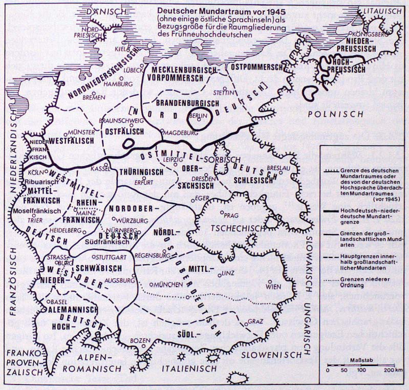

#13\. Positionen des Wörterbuchartikels. VI: die Angabe von Symptomwerten
**13.1\. Grundlegungen**

Die Angabe von Symptomwerten sollte idealiter genau den Kriterien entsprechen, nach denen sich das Varietätenspektrum der lexikographisch beschriebenen Sprache gliedern läßt. Im Falle des Frühneuhochdeutschen wären also der Raum, die Zeit, die Schicht, die Gruppe, der Situationstyp, die idiolektale Bindung mindestens des Wortes und jeder seiner Bedeutungen, maximal aber auch jeder Wortbildungsvariante, eines besonderen flexivischen Verhaltens, überhaupt einer bestimmten Worteigenschaft zu beschreiben. Im folgenden ist offenzulegen, wie und inwieweit dieses Programm realisiert wurde und welche Artikelpositionen dafür vorgesehen sind. – Bevor dies im einzelnen geschieht, soll vorausgeschickt werden, daß nicht nur der Wörterbuchartikel Information über die Symptomwerte bringt, sondern daß auch das Verzeichnis der Quellen deren räumliche und zeitliche Gültigkeit sowie ihre Textsortenzugehörigkeit angibt. Der Abschnitt 6.3\. _Kritische Prüfung des Corpus_ schlüsselt die Einzelangaben des Quellenverzeichnisses nach Zeit, Raum und Textsorte übersichtartig auf. – Ferner ist vorbereitend darzulegen, welche Raum-, Zeit- und Textsortengliederung den Symptomwertangaben zugrundeliegt.

13.1.1\. Die zugrundegelegte Raumgliederung

Eine lexikspezifische (im Gegensatz zu: phonemspezifische) Raumgliederung von (oder gar: der) Varietäten des Frühneuhochdeutschen existiert nicht, so wie sie ja selbst für das Neuhochdeutsche nur bezüglich einiger weniger Varietäten und selbst da nur ansatzweise begegnet[^110]110\. Phonem- und graphemgeographische Gliederungen der Gesamtsprache Frühneuhochdeutsch wären als (komplizierte) Zusammenfassung der Gliederung der räumlich dimensionierten Einzelvarietäten denkbar, sind in der Forschung aber nicht geleistet worden. Selbst Einzelgliederungen (z. B. der Dialekte oder der landschaftlichen Schreibsprachen) liegen nicht in der Weise vor, daß sie als Arbeitsgrundlage für die wissenschaftliche Praxis ‚Lexikographie‘ benutzt werden könnten. (Die Gründe hierfür sind mannigfacher Art; zum Teil sind sie durch den Forschungsstand bedingt, zum Teil ergeben sie sich aus den Beschränkungen der Überlieferung vor allem der gesprochenen Sprache).

13.1.1.1\. Will man diese Situation nicht als Alibi für einen Verzicht auf Raumangaben benutzen, hat man sich für eine bestimmte Arbeitsgrundlage zu entscheiden, auch wenn diese partiell unpassend sein mag. In Betracht kommen zwei Möglichkeiten,

(1) eine konsequent topographische Gliederung, z. B. nach Himmelsrichtungen, nach Oberflächenformen, nach Einzugsgebieten von Flüssen,

(2) eine Gliederung nach geschichtlichen Gegebenheiten, z. B. nach Stammes-, Territorial-, Kulturräumen oder auch nach irgendwie umgrenzten Sprachräumen.

13.1.1.2\. Der Bearbeiter hat sich trotz vieler Bedenken für die zweite Gliederungsmöglichkeit entschieden, und zwar in folgender Weise: Die Raumzuordnung der Quellen des Wörterbuches, damit die Raumangaben in den Wörterbuchartikeln, beruhen auf der vorwiegend phonemgeographischen Gliederung der Varietät ‚Dialekte‘ des Neuhochdeutschen nach ihrem Stande im 19\. und beginnenden 20\. Jahrhundert. Die Angabe _rhfrk._ (= _rheinfränkisch_) oder _schles._ (= _schlesisch_) z. B. heißt also: Die Quelle gehört in denjenigen vorwiegend phonemgeographisch bestimmten Sprachraum des Frühneuhochdeutschen, dessen geschichtliche Fortsetzung in das Neuhochdeutsche wiederum nach phonemgeographischen Gesichtspunkten als _Rhfrk._ oder als _Schles._ gekennzeichnet wird. Die Angabe hat nur insoweit einen Sinn, wie man zuzugestehen bereit ist, daß

(1) die Varietäten des Frühneuhochdeutschen insgesamt eine starke Landschaftsbindung aufweisen, sich also überhaupt geographisch einordnen lassen,

(2) die Raumgrenzen der neuhochdeutschen Dialekte sich gegenüber denjenigen des Frühneuhochdeutschen nicht wesentlich verschoben haben,

(3) die Wortgeographie zumindest partiell der Phonemgeographie folgt.

Die Punkte (1) und (2) sind nicht ernsthaft zu bezweifeln; Punkt (3) mag in nicht quantifizierbar vielen Fällen zutreffen, in vielen anderen aber absolut nicht. Insgesamt jedoch ist eine phonemgeographische Bezugsgröße für Worträume adäquater als eine konsequent topographische. Topographische Gliederungen haben als natürliche Gegebenheiten mit Wortlagerungen als geschichtlichen Gegebenheiten schlechterdings nichts zu tun.

13.1.1.3\. Konkret sieht die Bezugsgröße für die Beschreibung der Raumdimension des Wortschatzes wie folgt aus (die Karte dient der Orientierung für diejenigen Benutzer, die nicht Sprachhistoriker sind):

1\. Norddeutsch (Nrddt.) als hochdeutsch-niederdeutsche Varietätenmischung und als geschriebenes Hochdeutsch auf niederdeutschem Dialektgebiet

2\. Mitteldeutsch (Md.)

2.1\. Westmitteldeutsch (Wmd.)

2.1.1\. Mittelfränkisch (Mfrk.)

2.1.1.1\. Ribuarisch (Rib.)

2.1.1.2\. Moselfränkisch (Mosfrk.)

2.1.2\. Rheinfränkisch (Rhfrk.), darunter Pfälzisch (Pfälz.), Hessisch (Hess.)

2.2\. Ostmitteldeutsch (Omd.)

2.2.1\. Hochpreußisch (Preuß.)

2.2.2\. Thüringisch (Thür.)

2.2.3\. Obersächsisch (Osächs.)

2.2.4\. Schlesisch (Schles.)

3\. Oberdeutsch (Obd.)

3.1\. Nordoberdeutsch (Nobd.), darunter Südfränkisch (Sfrk.), Ostfränkisch (Ofrk.) und zu letzterem speziell Nürnbergisch (Nürnb.)

3.2\. Westoberdeutsch (Wobd.)

3.2.1\. Alemannisch (Alem.)

3.2.1.1\. Niederalemannisch (Nalem.), darunter Elsässisch (Els.), östliches Niederalemannisch (Önalem.)

3.2.1.2\. Hochalemannisch (Halem.), darunter Westhochalemannisch (Whalem.) und Osthochalemannisch (Ohalem.)

3.2.2\. Schwäbisch (Schwäb.)

3.3\. Ostoberdeutsch (Oobd.)

3.3.1\. Nördliches Ostoberdeutsch, Nordbairisch (Noobd.)

3.3.2\. Mittleres Ostoberdeutsch, Mittelbairisch (Moobd.), darunter der südliche Teil des mittleren Ostoberdeutschen, Südmittelbairischen (Smoobd.)

3.3.3\. Südliches Ostoberdeutsch, Südbairisch (Soobd.), darunter Tirolisch (Tir.)

4\. Östliches Inseldeutsch (als zusammenfassende Bezeichnung für alle östlichen Sprachinseln außerhalb des geschlossenen deutschen Sprachraumes, mit Ausnahme des Hochpreußischen, das wegen der Größe des Gebietes unter 2.2.1\. aufgeführt ist), darunter ungarisches, slowakisches, schlesisches, siebenbürgisches Inseldeutsch.

(Karte: Deutscher Mundartraum vor 1945)

13.1.1.4\. Die Raumangaben zu den Quellen haben im Durchschnitt den Feinheitsgrad, der durch den jeweils letzten Ordnungspunkt obiger Gliederung angegeben ist, also z. B. _thür._ oder _osächs._ In Einzelfällen kann eine Zuordnung zu einer größeren (z. B. _md._) oder zu einer kleineren (z. B. _whalem._) Raumeinheit erfolgen. Die Gründe variieren von Quelle zu Quelle.

13.1.1.5\. Die Raumangaben beziehen sich in der Regel auf das Gebiet, in dem die betreffende Quelle entstanden ist, d. h. in der Mehrzahl aller Fälle zugleich, dessen sprachgeographische Eigenheiten die Quelle aufweist. Für eine Reihe von Quellen ist zwischen dem Raum, dem der Verfasser der Quelle zugehört, und dem Raum, dem der Schreiber/Überarbeiter oder auch der Drucker angehört, zu unterscheiden. In diesen Fällen wird wie folgt verfahren: Bei Drucken wird der Druckort angegeben, also z. B. _Hagenau 1534_ für den ersten Band der Sprichwörtersammlung des keineswegs ins Elsaß, sondern in den ostmitteldeutschen Raum gehörigen Johannes Agricola; bei Handschriften erscheint immer dann der Entstehungsraum der Handschrift, wenn anzunehmen ist, daß zwischen handschriftlicher Fassung und einem vorausgesetzten Original ein erheblicher sprachraumbedingter Unterschied besteht oder wenn das Original nicht mehr zuverlässig rekonstruiert werden kann, man vgl. z. B. die Kennzeichnung _Hs. nd./md._ für den im süddeutschen Raum entstandenen Schwabenspiegel. Die Sigle _Hs._ hat den beschreibungssprachlichen Zweck, auf diesen Unterschied explizit hinzuweisen. – Die Raumangaben sind nach dem Vorgetragenen nur insofern als Hinweis auf den Rezeptionsraum eines Quellentextes zu verstehen, wie dieser sich mit dem Produktionsraum deckt. Differenzen zwischen Produktions- und Rezeptionsraum bleiben unbezeichnet. Lediglich bei Urkunden wird der Raum angegeben, für den sie ausgestellt sind.

13.1.2\. Die zugrundegelegte Zeitgliederung

13.1.2.1\. Während die Raumangaben nach einem (sprach)geschichtlichen Gliederungsprinzip erfolgten, ist ein solches für die Beschreibung der zeitlichen Gültigkeit eines Wortes, einer Wortbedeutung (usw.) nach dem heutigen Stande der Forschung nicht möglich. Zwar herrscht Einigkeit darüber, daß mit der Reformation auch sprachgeschichtlich eine Wende[^111] gegeben ist, unabhängig davon, ob man die Zeit nach 1520 z. B. als _Frühneudeutsch_ oder als _nationalsprachliche Epoche_[^112] charakterisiert, aber innerhalb der Spanne vom beginnenden 16\. bis zum beginnenden 17\. Jahrhundert gibt es weder für die Phonemik/Graphemik noch für die Morphologie, Lexik, Syntax oder für die Textsortengeschichte eine akzeptierte Subgliederung, so wie es diese auch für die Zeit von der Mitte des 14\. Jahrhunderts bis zur Reformation nicht gibt. Es bleibt deshalb nur der Ausweg, die Zeitangaben nach einem physikalistischen Zeitbegriff vorzunehmen, also z. B. nach Jahrhunderten oder durch Formulierungen des Typs _älteres, mittleres, spätes Frühneuhochdeutsch._ Dies geschieht allerdings mit einem schlechten lexikographischen Gewissen. Wo es deshalb möglich ist, die Zeitangaben nach geschichtlichen Ereignissen oder Entwicklungen auszurichten, geschieht dies. Im übrigen läßt die Verbindung von physikalistischer Zeitangabe mit geschichtlicher Raum- und vor allem mit der Textsortenangabe oft eine geschichtliche Interpretation der Zeitangabe zu, vgl.

**abscheiden** [...] 7\. [...] vor allem in mystischen Texten des 14\. Jhs.

Vielleicht sollte kurz erläutert werden, daß die hier dauernd vorausgesetzte Opposition von _geschichtlichem_ und _physikalistischem_ Zeitbegriff, oben entsprechend von _geschichtlichem_ und _topographischem_ Raumbegriff sprachgeschichtstheoretische Gründe hat. Das jeweils erste Adjektiv der Dichotomie meint die Zeit- und Raumdimension als Implikat der (auch sprachlichen) Handlungen von Menschen, letzteres sieht sie als natürliche Vorgegebenheiten ohne Bezug zu Geschichte als aspektuell gliederbarer Gestaltung von Menschen.

13.1.2.2\. Die Zeitangaben beziehen sich in Parallele zu den Raumangaben auf die Entstehungszeit, nicht auf die Rezeptionszeit der Quellen. – Die Differenz zwischen Entstehung eines Textes und Abschrift oder Druck wird bei Handschriften immer dann besonders – und zwar durch die Angabe _Hs. plus Zeit,_ z. B. _Hs. um 1410_ für den Schwabenspiegel – gekennzeichnet, wenn zwischen vorauszusetzendem Original und Abschrift ein erheblicher zeitbedingter Sprachunterschied besteht oder wenn das Original nicht mehr zuverlässig rekonstruiert werden kann. Bei Drucken wird das Erscheinungsjahr angegeben, also z. B. _Thorn 1584_ für C. K. Lemans Ausgabe des _Alten Kulmischen Rechts,_ dessen handschriftliche Vorlage um 1394 zu datieren ist. Verbindet sich (wie beim Schwabenspiegel) die Differenz zwischen Entstehungsraum des Werkes und Entstehungsraum der der Edition zugrundeliegenden Handschrift mit der Differenz zwischen Entstehungszeit des Werkes und Entstehungszeit der Handschrift (entsprechend des Druckes), so deutet das Skopuszeichen ⌈...⌉ an, daß sich die Angabe _Hs._ auf beides bezieht, vgl. _Hs. ⌈nd./md., um 1410⌉._ Überhaupt wird das Zeichen immer dann verwendet, wenn die Gefahr droht, daß eine bestimmte Angabe syntaktisch eine mehrfache Bezugsmöglichkeit hat: _⌈wohl Straßb.⌉ 1509_ (für Murners _fier ketzer_) schränkt den Bezug von _wohl_ auf den Druckort Straßburg ein; die Zeit (1509) steht also nicht in Zweifel.

13.1.3\. Die zugrundegelegte Textsortengliederung

Eine allgemein gültige Gliederung von Textsorten kann es von der Sache her nicht geben. Hier wird deshalb mit Modifikationen die Gliederung zugrundegelegt, die von W. Besch, W. Lenders, H. Moser und H. Stopp im Zusammenhang mit dem Projekt _Grammatik des Frühneuhochdeutschen_ entworfen wurde[^113]\. Der Rückgriff auf diese Gliederung hat rein praktische Gründe; sie ermöglicht hinreichend klare Unterscheidungen und hat einen gut handhabbaren Grad der Differenzierung[^114]\. Sie lautet (in modifizierter Form):

(1) Rechts- und wirtschaftsgeschichtliche Texte (Rewi.)

(2) Chronikalische und berichtende Texte (Chron.)

(3) Unterhaltende und literarische Texte (Lit.)

(4) Didaktische Texte (Did.)

(5) Kirchliche und theologische Texte (Theol.)

(6) Erbauliche Texte (Erb.)

(7) Realientexte (Real.)

(8) Wörterbücher (Wb.)

Im folgenden werden den genannten Gliederungseinheiten diejenigen Textsorten(gruppen) zugeordnet, die im Quellencorpus vertreten sind. Die Zusammenstellung erhebt keinerlei Anspruch auf Systematizität: Zum Teil werden Bezeichnungen aus dem Frühneuhochdeutschen selber verwendet, zum Teil begegnen die heutigen Termini; mehrfache Aufführung einer einzigen Textsorte unter verschiedenen Termini oder eines Terminus für unterschiedliche Textsorten waren deshalb nicht zu vermeiden; in Einzelfällen fehlt überhaupt eine Bezeichnung; die Benennungskriterien sind teils formaler, teils inhaltlicher, teils geschichtlich orientierter, teils funktionsbezogener Art; teils werden Textsorten, teils Textsortengruppen genannt.

(1) _Rechts- und wirtschaftsgeschichtliche Texte:_ Rechtsquellen, -texte, Gesetze, Verbotbücher, Fehdebücher, Achtbücher, Mandate, Ordnungen (Gerichtsordnungen, Dorfordnungen, Polizeiordnungen), Polizeisätze, Stadtbücher, Bergrechte, Weinbergrechte, Stadtrechte, Reformationen, Landrechte, Landsatzungen, Landtagsakten, Ratsverlässe, Weistümer, Taidinge, Traditionen, Regeln, Rechtsmitteilungen, Schöffensprüche, Schöffenbücher, Kanzleitexte, Verwaltungstexte, Grundbücher, Kaufbücher, Handelsakten, Zollakten, Protokolle, Register, Haushaltbücher, Salbücher, Ämterbücher, Konventsbücher, Zinsbücher, Lagerbücher, Rödel, Urbare, Rechnungen, Rechnungsbücher, Traktate.

(2) _Chronikalische und berichtende Texte:_ Chroniken, Berichte, Reisebücher, Denkwürdigkeiten, Geschichtsdarstellungen.

(3) _Unterhaltende und literarische Texte:_ Gedichte, Lieder, Meisterlieder, Gesellschaftslieder, Volkslieder, Leiche, Singsprüche, Reimpaare, Spruchdichtungen, Schauspiele, Dramen, Fastnachtspiele, geistliche Spiele, Schwänke, Fabeln, Briefe, Erzählungen, Novellen, Visionenliteratur, Heldendichtung (späte), Artusdichtung (späte), Übersetzungen fremdsprachiger Texte, Prosaauflösungen von Versepen, Romane (in Vers und Prosa), Volksbücher.

(4) _Didaktische Texte:_ Traktate, Klagen, Spiegel, Gedichte, Sprüche, Reimsprüche, Sprichwortsammlungen, religiöse Lieder, Kirchenlieder, Gesangbücher, Satiren, Meisterlieder, Minnereden, Flugschriften, Narrenliteratur, geistliche Spiele.

(5) _Kirchliche und theologische Texte:_ religiöse Lieder, Kirchenlieder, Gesangbücher, theologische Fachprosa, exegetische Schriften, mystische Texte, Regeln, Summen, Spiegel, Traktate, Dispute, Flugschriften, geistliche Spiele (darunter Passionsspiele, Osterspiele, Mirakelspiele, Weltgerichtsspiele), Legenden, Predigten, Evangelistare, Katechismen, Bibelübersetzungen, Historienbibeln, Breviarien.

(6) _Erbauliche Texte:_ religiöse Lieder, Sermones, Büchlein, Spiegel, Summarien, Sterbebücher, Leichabdankungen, Legenden, Trostbücher.

(7) _Realientexte:_ Anleitungen, Praktiken, Chirurgien, Poetiken, Kochbücher, Rezeptbücher, Aderlaßbücher, Pelzbücher, Gesundheitsregeln, Arzneibücher, Kunstbüchlein, Kriegsbücher, Traktate, Hortustexte, Kräuterbücher, Naturlehren, Astronomiebücher, Lehrbücher aller Art, Sprachbücher.

(8) _Wörterbücher:_ Dictionarien, Vokabularien, Sachglossare, Formulare, Reimwörterbücher, Synonymenwörterbücher, Fremdwörterbücher, Sprichwörterbücher, ein-, mehrsprachige Wörterbücher.

**13.2\. Die Artikelpositionen für die Angabe von Symptomwerten**

Symptomwertangaben beziehen sich in der Regel auf die Einzelbedeutung eines Wortes; sie können sich aber auch auf das Wort als Ganzes, auf eine einem bestimmten Lemma zugeordnete Wortbildungsvariante, auf besonderes flexivisches Verhalten oder auf andere Eigenschaften des Wortes beziehen. Dementsprechend sind für die Symptomwertangaben unterschiedliche Positionen des Wortartikels vorgesehen.

13.2.1\. Symptomwertangaben zu Einzelbedeutungen eines Wortes stehen, durch einen Gedankenstrich getrennt, unmittelbar im Anschluß an die jeweilige Bedeutungserläuterung. Sie bestehen maximal aus:

(1) einer Raumangabe (z. B. **abenteuer** [...] 1\. [...] – _Vorw. obd., gehäuft wobd._) (Kursive steht zur Kennzeichnung des Gemeinten),

(2) einer darauf folgenden Zeitangabe (z. B. **abenteuer** [...] 1\. [...] _14./15\. Jh._),

(3) weiteren Angaben, die von den Heterogenitätsdimensionen ‚Schicht‘, ‚Gruppe‘, ‚Situationstyp‘, ‚Idiolekt‘ (vgl. 5.1.2.) her motiviert sind. Die Sammelrubrik „weitere Angaben“ gestaltet sich in der Regel als Textsortenangabe, da diese die jeweilige schichten-, gruppen- und situationstypische Verwendungsweise des Wortes zusammenfassend wenn auch nicht zu beschreiben so doch anzudeuten vermag; vgl. **abenteuer** [...] 1\. [...] _fiktionale, archaisierende und historisierende Texte._ – In Einzelfällen erfolgen Hinweise auf die idiolektale Bindung einer Wortbedeutung; vgl. **abschälen** [...] 3\. [...] _Leitwort Meister Eckharts._

13.2.2\. Symptomwertangaben zum Wort als Ganzem stehen im Artikelkopf im Anschluß an die dortigen Teile der Bedeutungserläuterung, falls diese fehlen, im Anschluß an die jeweils vorgängigen Angaben zur Etymologie, zur Morphologie, zur Wortart. Die graphische Absetzung von der vorangehenden Position erfolgt wieder durch den Gedankenstrich; Reihenfolge und Inhalt der Angaben entsprechen demjenigen, was soeben für die einzelbedeutungsbezogene Symptomwertangabe gesagt wurde; vgl. **aböden,** V. – _Oobd. Weistümer._

13.2.3\. Symptomwertangaben zu Wortbildungs-, Flexionsvarianten oder sonstigen Eigenschaften des Wortes stehen im Zusammenhang mit der jeweiligen Beschreibungsposition.

13.2.4\. Auch die Belege werden mit Symptomwertangaben, und zwar mit einer Raum- und einer Zeitangabe versehen, es sei denn, daß Raum oder Zeit nicht festlegbar sind, in der zitierten Edition oder sonstiger Literatur nicht angegeben werden oder daß Raum- bzw. Zeitangaben z. B. wegen der Überregionalität der Sprache oder wegen Normalisierung auf das Mittelhochdeutsche hin nicht sinnvoll sind. Belegbezügliche Symptomwertangaben stehen in runden Klammern hinter der Angabe der Belegstelle, also in folgender Form: Ziesemer, Marienb. Konventsb. 296, 13 _(preuß., 1412):_ [Beleg].

13.2.4.1\. Die belegbezogenen Symptomwertangaben wiederholen die Raum- und Zeitangaben, nicht dagegen die Textsortenzuordnungen des Quellenverzeichnisses jeweils in der dort festgelegten Form. Hier ist deshalb nur noch darauf zu verweisen, daß durch ein Mittel der Interpunktion der Unterschied von Handschrift und Druck markiert wird. Ein Komma zwischen Raum- und Zeitangabe, also z. B. _osächs., 1343_ bedeutet: Die so gekennzeichnete Quelle ist eine Handschrift. Das Fehlen eines Interpunktionszeichens an dieser Stelle wie z. B. in _Thorn 1584_ bedeutet: Die Quelle ist ein Druck. – Alle nicht belegbezogenen Symptomwertangaben sind Zusammenfassungen der Einzelangaben zu den Belegen; aus den Angaben _moobd., 1671; smoobd., Hs. 18\. Jh.; m/soobd., 1606_ (usw.) und der Nennung der jeweiligen Quelle wird also die Angabe: _Oobd. Weistümer_ (zu **aböden**). Dies heißt umgekehrt: Immer dann, wenn sich aus den belegbezogenen Symptomwertangaben keine Zusammenfassung nahelegt, wird auf letztere verzichtet.

13.2.4.2\. Die Angabe der Symptomwerte zu den Belegen erfordert, da sie sich für eine Quelle so oft wiederholt, wie diese einen Belegtext liefert, sehr viel Druckraum. Dem Bearbeiter wurde deshalb von Kollegen immer wieder empfohlen, auf diese Angaben zu verzichten; sie könnten im Verzeichnis der Quellen ja jederzeit nachgeschlagen werden. Wenn ich mich trotz dieser Hinweise für das dargelegte, zugestandenerweise sehr aufwendige Verfahren entschieden habe, dann hat dies die im folgenden unter (1) bis (3) aufgeführten allgemein-lexikographischen Gründe sowie den unter (4) genannten Gewichtungsgrund.

(1) Wörterbücher sind Nachschlagetexte. Sie erfüllen diese Funktion um so besser, je weniger Nachschlagehandlungen erforderlich sind, damit man auf eine Frage eine Antwort erhält, umgekehrt: je mehr Information in dem Artikel enthalten ist, der im ersten Nachschlagegriff eingesehen wird. Insbesondere bei Mehrbändern ist der jeweilige Rückgriff auf den das Quellenverzeichnis enthaltenden Band so zeitaufwendig und lästig, daß meist darauf verzichtet wird.

(2) Wörterbücher haben einen oft so hohen Grad der Textverdichtung, daß sie selbst für den Sprachhistoriker kaum lesbar sind. Man weiß aus eigener Erfahrung, wie lange es gedauert hat, bis man die Fertigkeit gewonnen hatte, vom _Kleinen_ auf den _Großen Lexer_ umzusteigen oder das DWB zum wirklichen Arbeitsinstrument zu machen. Dies kann aber nur heißen, daß der Verdichtungsgrad von Wörterbuchartikeln durch Anbringen von Redundanzen, sofern diese leicht lesbar sind, zu verringern ist. Angaben des Typs _Thorn 1584_ oder _osächs., 1343_ lassen den Nachschlagenden die Quellen zeitlich und räumlich orten, sie geben damit die Möglichkeit, sie auf ein durch seine Allgemeinbildung gesichtertes geschichtlich-räumliches Koordinatensystem zu beziehen und gewährleisten mit dadurch einen Brückenschlag zum Hintergrund seiner Fragestellung, das heißt zum Bekannten. Unbekanntes ist nie als solches, sondern nur durch Anknüpfung an Bekanntes bekannt zu machen.

(3) Wort- und einzelbedeutungsbezogene Symptomwertangaben als Zusammenfassung der Angaben zu den Belegen werden nur dann vorgenommen, wenn sich wirklich ein überzeugendes Gesamtbild ergibt. Dies ist aber in der Mehrzahl aller Fälle nicht möglich. Die belegbezogenen Symptomwertangaben dienen dann immerhin als Bausteine, die mit eventuell vorhandenen eigenen Informationen des Benutzers ein Gesamtbild anzudeuten vermögen oder aber es als nicht möglich erweisen.

(4) Symptomwerte haben in einer Sprachstufe ohne ausgeprägte Leitvarietät einen besonderen Stellenwert unter den 4.3.2.1\. erläuterten pragmatischen Aspekten; ihre Beschreibung macht es möglich, einen Text in ein jeweils spezifisches kommunikationsgeschichtliches Kräftefeld handelnder Menschen (Gruppen) zu stellen, damit erst seine Illokution (Handlungsbedeutung) zu erkennen, statt seinen Inhalt als gleichsam geschichtslose Gegebenheit nur auf der propositionalen Ebene zu erfassen. Symptomwerte sind insofern Indikatoren für Geschichtlichkeit, letztere aufgefaßt als ein zugleich synchrones wie der zeitlichen Veränderung unterliegendes Wechselspiel typischer Handlungen von in Raum-, Zeit-, Sozial- und Situationsbindungen stehenden Individuen und Gruppen. Wie aufschlußreich die Beschreibungen solcher Spiele sein können, sei anhand einiger Beispiele angedeutet: _abenteuer_ hatte am Anfang der Epoche vorwiegend an den höfischen Rahmen gebundene Bedeutungen, darunter ›ritterliche Bewährungsprobe‹. Gegen Ende der Epoche ist das Bedeutungsspektrum auf den bürgerlichen Bereich bezogen: _abenteuer_ bezeichnet minderwertige Handelswaren, Bergschätze ebenso wie das städtische Schützenfest; seine Verwendung ist durchgehend pejorisiert, man vgl. ›Lügengeschichte‹, ›Posse‹. – Bei _ablas_ liegt eine vergleichbare Entwicklung vor: Das Spektrum neutraler, vor allem dem Bereich von Recht und Religion zugehöriger Bedeutungen erweitert sich und wird teilweise verdrängt durch ein Spektrum, das von den negativen Einstellungen gegenüber der kirchlichen Ablaßpraxis beeinflußt ist und Bedeutungen wie ›Jahrmarkt‹, ›finanzielle Ausbeutung‹ und ›Mißbrauch (im sexuellen Sinne)‹ umfaßt[^115]\. – _arbeit_ meint seit dem beginnenden 16\. Jahrhundert nicht mehr nur die allgemeinen und besonderen Nöte und Qualen des Lebens, sondern zunehmend die ethisch positiv bewertete berufliche Tätigkeit. Diese Bedeutung wird so dominant, daß die erstgenannten Verwendungsweisen der Archaisierung unterliegen und partiell ganz außer Gebrauch kommen. – Die möglichst exakte Dokumentation solcher Überlagerungen, Verschiebungen, Polysemierungen nach ihrer zeitlichen Entstehung und Dauer, nach ihren räumlichen Ansätzen und Ausdehnungen, nach ihrer Verwendung in den Textsorten liegt dem Bearbeiter besonders am Herzen.